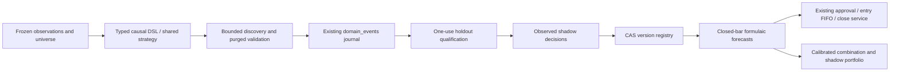

# Alpha discovery, qualification and deployment

Schema **008_alpha_pipeline** implements the first engineering stages of the
[alpha review roadmap](alpha-stack-review.md). That review is a historical defect
report; this document describes the current contracts. Research performance is
neither broker P&L nor proof of deployability.

## Architecture and ownership



The pure research layer contains expressions, strategy contracts, simulations,
statistics, forecasts and optimization. `AlphaPromotionService` and
`AlphaShadowService` coordinate evidence; `AlphaRepository` uses the existing
journal and lock/transaction pattern. One `alpha_projections` table is a replayable
read model, not a second order queue. Immutable versions and past decisions survive
registry changes and replay. Data arrays stay in private NPZ artifacts, outside Git
and outside the event journal. No research command sends Telegram notifications.

A scan installs one immutable registry snapshot under its existing scan lock.
Activation/demotion takes effect at the next scan without a restart; generation
compare-and-swap rejects concurrent stale operator changes. Durable entry admission
also checks exact active version/policy under the registry lock at reservation and
submission commit. Demoted or legacy unversioned alpha suggestions cannot open new
risk. Already-committed uncertain submissions remain lookup-only and existing
positions retain protection. Readiness checks the
current daemon's registry acknowledgment. `alpha status` and doctor expose the
latest recorded research status separately from operational readiness.

## Causal strategy contract

An alpha version hashes its expression AST, logical ID, direction, entry threshold,
normalization window, timeframe, symbol universe, feed/adjustment and execution
policy. Display names/descriptions do not change its identity. New session definitions additionally hash their explicit decision delay/expiry
and layout under semantics version 3; version-2 documents and hashes are unchanged.
See [session decisions](alpha-session-decisions.md). No field can mutate
a deployed definition. Changing any trading semantics requires a new version and
new evidence. Historical signals retain their original metadata; missing historical
versions are not invented.

- Expressions accept observed OHLCV, returns, VWAP when supplied, and open gaps.
  Global `rank`/`scale`, negative lags, unknown functions/fields, invalid arity,
  arbitrary Python access and unsupported arithmetic are rejected.
- AST length/depth/node count, lag/window bounds and dimensional units are checked.
  Missing inputs, warmup and undefined division remain unavailable; they are never
  zero-filled into a trading signal.
- New operators include `roc`, `realized_vol`, rolling regression slope/residual,
  median absolute deviation, rolling sum and clipping. Panel rank/z-score/group
  neutralization require exactly aligned panels; they are separate from the
  single-symbol expression grammar.
- Research and live use the same full-window normalization (default 30), direction
  rules and exact timeframe. No timeframe fallback. Forming bars are excluded;
  daily bars become eligible the next UTC day. Feed, adjustment and closed-bar
  freshness are checked before a qualified version can emit a live candidate.
  Daily freshness is deliberately conservative across holiday/weekend gaps until
  exchange-calendar-aware freshness is wired; it may suppress a legitimate signal.
- Alpha protection uses a **finite rolling mean of true range**, explicitly named
  `simple_true_range` in its policy. This avoids a hidden initialization-history
  difference between research and live. Built-in strategies retain their own ATR.
  Recursive DSL `ema` is research-only for promotion until shared initialization
  state is supported; causality alone does not guarantee history-prefix parity.
- Shared structural/ATR brackets, tick rounding and initial-risk trailing replace
  the old research-only score-decay exit. The LLM may veto or explain an alpha but
  cannot silently rewrite its versioned stop/target. Signal records include version,
  timeframe, policy, candle, score and contributing candidates.

### What the simulator establishes

**Intraday promotion is currently blocked.** Alpaca intraday bars can contain
extended-hours prices, while brackets cannot execute in extended hours. A finer
execution timeline tied to observed exchange sessions is required before 15m/1h/4h
results can qualify; filtering mixed-session hourly bars after aggregation is not
sufficient. Those simulations are explicitly diagnostic. The current promotion
path supports daily hypotheses. See Alpaca's [bar construction rules](https://docs.alpaca.markets/us/docs/market-data-faq)
and [bracket restrictions](https://docs.alpaca.markets/us/docs/orders-at-alpaca).

The [session/minute replay](alpha-session-replay.md) implements the diagnostic clock
using observed calendars and complete raw minute coverage. It shares bracket
execution with the coarse simulator and retains decision/order event traces.
Explicit session snapshots now share versioned screening/shadow timing, but normal
scans do not yet acquire/schedule them. This does not authorize intraday qualification;
its session-derived/native-bar and broker execution differences remain explicit.


A closed-bar signal creates a GTC limit at the tick-rounded observed close, eligible
from the next bar. An adverse open cannot fill beyond the limit. Unfilled orders
remain pending until touched; folds start flat without inherited orders. Open trades
and pending entries at the end remain censored, with open exposure marked to market.
Stops take priority when both exits touch; gaps use the opening price. An intrabar
entry cannot claim a target that might have occurred before its fill. Costs apply
on both fills. Win rate and profit factor use completed trades; an undefined profit
factor stays null. Annualization uses observed calendar cadence; DSR uses unrounded
per-observation Sharpe and actual sample moments.

Every supplied execution bar contributes a finite equity return, including cash
periods with unavailable features. Missing features suppress signals; missing OHLC
invalidates the simulation. Return consumers reject missing/duplicate/unordered
observations instead of compressing time. Trial and holdout evidence includes
feature coverage. See the [return-timeline contract](alpha-return-timeline.md).

OHLC bars cannot establish queue priority, available fill size, partial fills,
spread/borrow costs, intrabar paths or operator approval latency. Macro/session/risk
admission can suppress live entries. Trailing runs at observed closes in simulation
and at position-monitor observations in the daemon. Backtests are conditional policy
experiments; exact live returns still require broker-fill evidence. Alpaca's
[order semantics](https://docs.alpaca.markets/docs/trading/orders/) govern actual orders.

## Validation and promotion gates

Discovery uses the first 80% of the frozen dataset, three expanding validation
folds, purged labels and an embargo. Feature and regression fitting uses training
observations only. Search never evaluates the final holdout. Prefix/future-perturbation
tests cover both formula and model-baseline paths.

The CLI charges the predeclared trial budget before computation. A crash, timeout
or exhausted search cannot erase attempts or refund the selection penalty. Completed
trials (including rejection) retain their individual evidence; interrupted symbols
retain the conservative reserved count. Runs persist seeds, policy,
all candidates, data/universe hashes, package versions, lockfile hash and source
revision. Family counts span symbols, seeds, methods and timeframes; variance remains in the
matching per-observation timeframe and return-timeline units. Lifetime attempt
counts retain old research, while variance samples use the current timeline only.
New runs, qualifications, promotion and entry commit check the current validation
policy. Old policy evidence cannot be silently reinterpreted. Ridge
and boosted-tree experiments count too. DSR is a model-dependent screening statistic,
not a calibrated probability of live profit. See the
[original DSR paper](https://www.davidhbailey.com/dhbpapers/deflated-sharpe.pdf).

`qualify RUN VERSION` freezes one already-evaluated finalist and **durably consumes
its holdout interval before computing results**. Crash, failure, renamed run, changed
seed, changed feed/timeframe or moving the end date cannot reuse overlapping
observations for the same symbol for free. A new
nonoverlapping period can produce a new immutable qualification decision for the
same version; the journal retains previous decisions.

Default gates include validation/holdout Sharpe 1.0, DSR 0.95, positive validation
folds, validation IC 0.01, at least 10 completed simulated trades, maximum holdout
drawdown 20%, positive return under doubled friction, and a positive lower block
bootstrap mean bound. Incumbent loadings fit training observations; incremental
predictive checks use subsequent forward labels. Missing/errored evidence rejects.
A changed incumbent set invalidates activation until fresh incremental evidence exists.

Deployment requires the exact Alpaca IEX/SIP raw-data contract and explicitly
qualified symbols. Yahoo research is discovery-only; its CLI explicitly requests raw observations.
The ordinary Yahoo fallback retains adjusted historical prices and labels that
contract; it cannot substitute for a qualified Alpaca version. Promotion also requires,
per symbol, **20 observed shadow dates and 10 triggered decisions**, plus qualification
no older than 45 days. These are validated `alpha_pipeline` configuration fields.
Time alone is insufficient; these counts are a minimum observation gate, not proof
of execution quality. Further paper-fill/capacity review remains required before
scaling any strategy. Invalid, stale or wrong-feed observations earn no shadow credit.

Historical `config/promoted_alphas.yaml` is **explicit import only**. Its metrics,
allocation weights and promoted labels are not trusted. Import retains definitions
as unqualified shadow versions; it cannot activate orders. Existing positions keep
broker protection and historical ownership while new formulaic risk is gated.

## Multiple alphas and portfolio constraints

One instrument has one formulaic execution owner. Overlapping alpha universes
cannot both activate; same-direction screener proposals get one deterministic owner
and retain contributors. Timeframe filtering happens before conflict resolution.
Opposing proposals follow the existing configured policy. This is arbitration,
not a claim that raw z-scores can be added as independent alpha allocations.

Training-only calibration carries explicit horizon, return label, feed, adjustment,
bar clock and currency. Outcome availability is checked against the training cutoff.
Forecast-mean HAC standard errors are distinct from return volatility. Explicit weighted
blends reject duplicate families/calibrations and use a worst-correlation error bound.
Stale/future/mismatched evidence fails explicitly; legacy untyped calibrations are
journaled as unavailable, never silently reinterpreted.

`alpha portfolio SNAPSHOT.json --output REPORT.json` builds a **shadow-only** vector
of actual filled holdings. Nonzero pending orders block construction until reachable
risk and executable plans are supported. Fresh account/data/config versions and a
matching explicit `risk_contract` are required, with complete covariance, tradability,
shortability, liquidity and group observations. Liquidity bounds traded notional,
separately from final position size. Existing positions count before deterministic
preselection; this position-count heuristic is not globally optimal allocation.
Closing/nontradable holdings must be explicitly locked by the input adapter.

CVXPY/Clarabel solves expected return minus variance, turnover-cost and forecast-error
penalties with gross, per-name, turnover, overlapping group and optional net/factor
bounds. Only strict optimal results passing independent feasibility checks yield
weights. Failure returns **no target**. Immutable private reports retain input/hash,
contracts, policy, objective components, solver settings, constraint margins/duals and
covariance eigenvalues. See [the hardening contract](forecast-contract-hardening.md)
for uncertainty assumptions, input schema and limits.

Combined portfolio execution stays disabled. Versioned rebalance plans, post-rounding
risk, partial-fill attribution and shared protective-order ownership must be implemented
and exercised through the existing execution services before enabling it.

## Forecast-component research

`alpha benchmark` now compares explicit-horizon single-feature, Ridge and boosted
forecasts on the saved discovery prefix. It reports predictive skill and fold coverage,
not bracket-policy profit or promotion evidence. See the [contract](alpha-forecast-benchmarks.md).
Old baseline artifacts retain their original meanings; new diagnostics cannot qualify.

## Commands and cadence

```bash
uv run copilot alpha catalog
uv run copilot alpha calibrate --seeds 10 --bootstrap-samples 499
uv run copilot alpha mine --universe etf32 --feed alpaca --interval 1d --lookback 5y --iterations 9 --method genetic
uv run copilot alpha benchmark RUN_ID --method ridge --budget 5
uv run copilot alpha benchmark RUN_ID --method boosted --budget 5
uv run copilot alpha inspect VERSION_ID
uv run copilot alpha qualify RUN_ID VERSION_ID
uv run copilot alpha shadow VERSION_ID --generation N
uv run copilot alpha promote VERSION_ID --generation N
uv run copilot alpha demote VERSION_ID --generation N
uv run copilot alpha list
uv run copilot alpha status
uv run copilot alpha forward --days 7  # recorded diagnostic outcomes; no trading/qualification credit
uv run copilot alpha export
```

### Synthetic calibration

`alpha calibrate` runs causal volume-pulse controls through the shared miner,
bracket simulator and statistical assessment. It also runs a joint circular-block
max-statistic diagnostic on fixed correlated return panels. Each JSON report records
the protocol hash, seeds, budgets, source/dependency identity, per-gate failures,
acceptance rates and Wilson uncertainty intervals. `--family-trials` and
`--trial-variance` explicitly set the DSR comparison scenario; defaults are synthetic
study parameters, not an automatic read of the research ledger.

The command runs computation off the event loop and opens no runtime config,
database, market-data provider, broker or notifier. Output defaults to the private
research artifact directory; `--output` selects a new file. Publication is atomic,
mode 0600, and never overwrites existing evidence. Invalid/oversized budgets fail.

Synthetic reports are diagnostic only. They cannot qualify, activate, earn shadow
credit or replace cumulative trial accounting. The fixed-panel bootstrap shares
resampled row blocks across candidates; it does not replay adaptive discovery and
is not a replacement promotion gate. Null rejection and planted-edge detection
measure only the declared synthetic scenarios. See the
[calibration milestones](alpha-roadmap.md#a1--calibration-before-more-search).

Qualification rejects non-finite validation metrics and invalid Sharpe sampling
variance explicitly; it never clamps invalid moments into artificial confidence.
Statistical assessment is shared with calibration, while deployment eligibility
still requires the exact Alpaca data contract and durable journal permissions.

### Predeclared calibration studies

`alpha study-plan --output NEW.json` writes a frozen default protocol. The reviewed
A1b protocol is preserved as `config/research/a1b-v1.json`; its
[study design](alpha-study-protocol.md) defines the comparisons and acceptance bounds.
The current [A2a follow-up](alpha-return-timeline.md) uses `config/research/a2a-v1.json`:
`alpha study config/research/a2a-v1.json --output /private/path/NEW-DIRECTORY`.
Use `study-plan --seed N` to predeclare fresh streams. Current code refuses the old
A1b protocol because its scientific contracts differ; preserve the original results.

The study runs development before validation with disjoint 128-bit seed namespaces.
It compares fixed-panel bootstrap/ARCH SPA methods and replays actual random/genetic
search, freezing one winner before any holdout computation. Existing scientific
gates and a separate sample-split comparator are evaluated without authorizing
promotion. The latter deliberately omits some runtime gates and is research-only.
Neither raw trial history nor cumulative production accounting is discounted.

This command uses no runtime config, database, broker, provider or notifier. CPU and
artifact work run off the event loop. Use a separate CLI process with numerical
threads limited when running beside the paper daemon. No research scheduling changes.

The private output directory is exclusive: no overwrite or implicit resume. A manifest
records the protocol, source/dependency identity, start time and reserved budget before
work. Every replicate retains its trial history, seeds, outcome and elapsed time in an
atomic 0600 JSON artifact. Development computation failures leave validation untouched;
all missing/failed jobs keep their denominators and make the summary incomplete. Duplicate
or mismatched evidence is refused. `completion.json` separates completion from meeting
the statistical criteria; a completed negative study exits successfully, while an
incomplete study exits nonzero. No result grants deployment or shadow credit.
The [September 16 study](alpha-study-2026-09-16.md) retained all 1,952 records but
has 22 unavailable comparisons. A2a corrects execution return coverage and versions
the validation contract. Its [fresh study](alpha-timeline-study-2026-09-16.md)
completed 1,952 jobs without unavailable comparisons. Null-search criteria passed;
positive-control power remains insufficient and thresholds remain unchanged. Unexpected post-mining
comparison errors retain completed search history. Hard interruption mid-replicate
retains the manifest/prior records, not every in-memory trial.

### Mining operation

Mining persists one checkpoint per symbol. Per-symbol compute defaults to 300 seconds;
completed trials are retained if that budget expires. An individual bounded trial
finishes before cancellation is checked. Input/discovery failures are journaled and
other symbols continue; the overall CLI exits nonzero when any symbol fails.
Network timeouts remain provider transport policy. Re-running completed research
counts new trials; it is not a free statistical reset.

Installed weekly mining is staggered to **Saturday 03:00 local time**. The divergent automatic retuner has been removed.
It requests 9 genetic proposals plus 7 catalog trials on each of 32 ETFs (512 trials
maximum), 5y daily Alpaca observations, and a 120-second per-symbol compute budget.
It never qualifies or promotes automatically. Use `launchd.sh install-miner` after
changing its generator; the installed plist does not update itself.

The 32-ETF universe is versioned current membership, spanning broad/sector/international
equities, rates/credit and metals. It is not historical point-in-time membership or
blanket execution eligibility. New instruments still require configured risk/contract
policy and observed liquidity/borrow/feed coverage.

## Experiment gates and remaining work

1. Add a session-correct fine-bar execution timeline for intraday qualification;
   the diagnostic replay clock and receipt-aware forward worker are implemented, while
   actual forward and broker execution evidence remain. Current intraday results fail promotion. Collect real deployment-feed shadow decisions and review execution assumptions,
   realized costs and sufficient paper fills before activating/scaling any new alpha.
2. Compare seeded random/templates, typed genetic search, Ridge and histogram-gradient
   boosting with matched total trial budgets across seeds/universes. ML models are
   research-only; their artifacts cannot enter the DSL registry. Canonical expressions and duplicate normalized discovery score behavior are
   deduplicated, with a bounded structural diversity archive. Larger cross-market
   ablations and approximate semantic clustering remain experiments.
3. Add point-in-time 100–200-equity membership, delistings and historical eligibility
   data before claiming survivorship-safe stock-panel validation. Add leave-cohort-out
   transfer tests before broadening a qualified deployment universe.
4. Keep RL/AlphaGen/AlphaForge/distributional-RL experiments behind the same evidence
   contracts; justify their complexity against established baselines first.
5. Complete portfolio execution attribution/protection before lifting single-owner
   admission. Add daily decay/cost/capacity monitoring after sufficient forward data;
   the current shadow journal records observations, not a validated decay estimator.

See [implementation evidence](alpha-pipeline-implementation.md) for tests, experiments
and deployment verification, recorded separately.

External notebooks/diagnostic reviews also spend evidence. Record their symbol,
observed interval and trial count with `alpha exclude-period --symbol SPY --start
2025-01-01T00:00:00+00:00 --end 2025-06-01T00:00:00+00:00 --trials 5 --reason
'External diagnostic'`. This is idempotent, adds to the family count, and blocks
future qualification on overlapping observations. It cannot erase consumption or
qualify a strategy. The deployment runbook applies this to this review's exposed
legacy diagnostic periods.

`alpha test` automatically excludes its examined interval and counts its diagnostic
trial before evaluation. It cannot be used to peek at a period and then qualify on
that same period through another command.

The [active roadmap](alpha-roadmap.md) owns future milestone order and acceptance criteria; [campaign evidence](alpha-research-2026-09-16.md) explains why calibration comes first.


### Prospective data-clock evidence

The [session observer](alpha-forward-observations.md) records actual REST receipts,
coverage failures and distinct revisions through the existing alpha journal.
`alpha status` reports it separately from research. Inspected dates cannot become
fresh holdouts; observations add no formula trials or qualifying shadow sessions.
Strategy identities, scoring and promotion gates remain unchanged.

`alpha benchmark` supports explicit `--label`/`--feature` and optional per-side
`--cost-bps` scenarios. These are charged daily bar-price payoff diagnostics with
no promotion or broker-fill claim; see [timing/cost contracts](alpha-forecast-policy.md).


### Durable candidate decisions

The daemon also owns the [receipt-aware diagnostic evaluator](alpha-session-decisions.md#durable-diagnostic-worker).
`alpha_pipeline.decisions` bounds its universe/history/work; `alpha_decisions` readiness
is separate from capture quality. Immutable claims/cursors/results use the existing
journal and private `forward-decisions` artifacts. A healthy worker with no eligible
version-3 candidates is idle, not evidence of a forward score. No promotion, orders,
qualified shadow credit or synthetic Telegram messages follow from these diagnostics.

## Optional timed session policies

[Trade lifetimes](alpha-trade-lifetimes.md) add immutable elapsed-UTC entry/holding intent to explicit session definitions. Historical execution dictionaries retain their hashes and unlimited GTC semantics. Replay and broker orchestration share deadline functions; timed replay remains idealized full-size OHLC execution, so SDK integration coverage does not replace prospective broker evidence. Timed policies remain subject to the existing session qualification/activation/admission gates. The continuous and persistent-book studies are complete; prior campaign failures remain retained. Current priorities live in the [alpha roadmap](alpha-roadmap.md#source-calibration-and-individual-equities--current-ordered-priorities).

The [persistent ETF book experiment](alpha-persistent-book.md) uses the shared
panel journal and explicit adjusted-price accounting. It is research-only: reserve
the frozen matrix before access; no promotion or live portfolio execution.
[Verified feed access and alternatives](research-data-sources.md) distinguish
recent-SIP entitlement from throttling; historical SIP remains usable.

Source-specific [volume calibration](alpha-volume-calibration.md) uses the shared
daily study harness with frozen training/forward intervals and exact feed identity.
`alpha volume-study` is research-only. `/alphas` now provides a compact explanation
and status summary; use `alpha forward` and `alpha list` for full evidence/definitions.

### Frozen daily equity liquidity screen

`alpha liquidity-study` now screens every member of the [dated equity cohort](alpha-equity-universe.md)
using an observed exchange calendar and completed native daily bars. The pure policy
requires complete trailing coverage, positive source volume and a price floor, then
ranks by median close × volume with a stable asset UUID tie-break. IEX activity is
not consolidated market capacity. This is current-cohort development evidence; it
cannot establish historical eligibility, common-stock subtype or alpha qualification.

The existing daily study service owns acquisition and journal charging. Its injected
`DailyAcquisitionConfig` bounds symbols, history, elapsed acquisition time and the
interval between top-level source calls (SDK pagination may make additional HTTP
requests). Each member gets an immutable checkpoint before the next read. Known
empty responses remain missing coverage; failed or invalid inputs withhold selection.
Portfolio/volume studies still require complete inputs. Cancellation drains the current
bounded read and checkpoint; its charged unfinished manifest remains, without a
completion claim or automatic replay. Freeze a new attempt before another acquisition.

### Matched retained forecast controls

`alpha forecast-controls` evaluates fixed reversal/volatility/blended controls against frozen panel Ridge forecasts with identical decision support. The [contract](alpha-forecast-controls.md) keeps source-price and positive-endpoint-volume outcomes separate, reuses shared basket accounting, and charges all comparisons through the existing journal. No refit, qualification, new market observation or allocation authority is implied.


### Paired gate-power diagnosis

The [power study](alpha-power-ablation-plan.md) follows both the known control and
the selected winner from the same discovery run. Qualification now separates
immutable statistical measurements from criteria assessment; count/variance
sensitivities reuse the exact simulations, bootstrap and novelty evidence. Valid
qualification decisions and reason order are unchanged. Missing sampling moments,
nonfinite gate values and malformed incumbent evidence explicitly fail closed.
Each criterion retains its value, threshold and pass/fail/unavailable status.

Execution diagnostics observe the shared simulator, including pending/holding
suppression, delayed entries, boundary censoring and fees. They introduce no new
execution policy. Development failures preserve completed evidence and leave
validation untouched. These synthetic artifacts cannot qualify or accrue shadow
credit. Factor hypotheses follow the [bounded research plan](alpha-factor-research-plan.md).

## Prospective native-daily panel lane

The [daily equity panel](alpha-daily-panel.md) collects four fixed forecasts and
first H20 outcomes using the existing alpha journal. This current-cohort experiment
is distinct from formula/bracket qualification, session-clock diagnostics and
portfolio execution. Enrollment charges its four hypotheses once; daily observations
add evidence, not new parameter trials. No automatic activation is supported.
