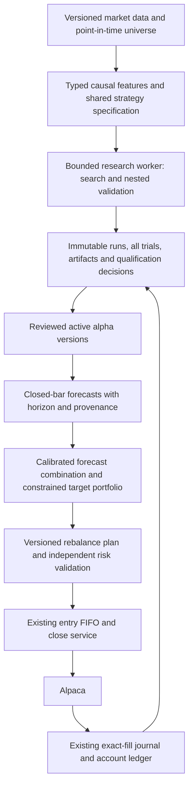

# Alpha mining review — September 16, 2026

> Historical review at revision a864e27. The implementation and current contracts
> are in [alpha-pipeline.md](alpha-pipeline.md), with measured follow-up evidence in
> [alpha-pipeline-implementation.md](alpha-pipeline-implementation.md). Defect counts,
> strict xfails and runtime descriptions below record the pre-fix baseline.


Reviewed source baseline: `641e433` (PR #32). This is an assessment and executable
diagnostic suite, **not a change to active alphas, risk limits, universe or schedules**.
The earlier corporate-action, macro freshness, trailing-stop, composition and
operations priorities remain in [architecture review](architecture-review.md#remaining-findings-ranked).

## Recommendation

**Repair validation and research/live parity before increasing search volume or
connecting optimization to execution.** There is a useful formula evaluator and
an operator-approved execution stack, but the present mining statistics do not
justify treating a promoted formula as a validated investment strategy.

| Question | Recommendation | Benefit / principal risk |
| --- | --- | --- |
| Expand symbols? | Yes, first in research: a diversified, versioned 25–40 liquid ETF panel, then a point-in-time 100–200 equity panel. Keep deployment eligibility separate. | Tests transfer across market exposures; additional correlated tickers and survivorship bias can create false confidence. |
| Expand DSL? | Correct causality, typing and missing-data contracts first; then add a small set of economic features and explicit cross-sectional operators. | More useful hypotheses without an uncontrolled expression search space. |
| Add algorithms/ML? | Seeded random search baseline, typed genetic programming with diversity penalties, then ridge/elastic-net and boosted-tree comparison. Research RL/generative methods later. | Reproducible incremental experiments; complex methods consume more trials and compute and can overfit more efficiently. |
| Mine more often? | Keep weekly discovery initially. Add daily health/decay evaluation and a slower, predeclared promotion review. | Fresher evidence without treating repeated reuse of the same holdout as new validation. |
| Multiple active alphas? | Supported as competing screeners, with conservative shared execution limits. Not yet a portfolio of independently allocated sleeves. | Existing FIFO/reservations protect admission; signal aggregation, versioning and portfolio attribution need further work. |
| Convex bounds / orthogonality? | Research components only today. Fit residualization on training data and introduce a validated portfolio-target layer before any live optimizer integration. | Diversification and explicit exposure controls; numerical orthogonality alone does not imply independent P&L or safe execution. |

## What actually runs

1. Launchd's weekly miner downloads **two years of daily Yahoo bars**, with 25
   random-template candidates plus seven catalog formulas. The ten requested symbols
   are NVDA, AMD, AAPL, MSFT, QQQ, SPY, GOOGL, AMZN, META and TSLA.
2. Discovery/gating occurs **only on the first symbol, NVDA**. Surviving formulas
   are evaluated on the remaining symbols. This is not a pooled multi-symbol search;
   changing the first symbol changes which candidates the rest ever see.
3. The generator randomly samples six templates. There is no population, crossover,
   mutation, parent fitness selection or learned proposal model. “Genetic search”
   in old comments/help/history overstates the implementation.
4. Scores receive a 70/30 chronological split. The same trailing 30% is used to
   filter and rank candidates. It is a **selection/validation set**, not an untouched
   final test. There is no run-wide experiment registry or cumulative trial ledger.
5. CLI qualification computes residual diagnostics. Explicit `--auto-promote`
   writes YAML; the scheduled job does **not** enable this option. Manual/chat
   promotion can also accept a definition without validation evidence.
6. Four YAML records are promoted: WQ-006 (4h, all configured symbols), WQ-053
   (4h, NVDA/AMD), trend-expansion (4h, QQQ/SPY), WQ-012 (15m,
   SPY/QQQ/IWM/AAPL/NVDA). Three have no stored metrics. WQ-006's metrics entered
   Git with its initial configuration in `f45e532`; no dataset/run artifact is
   linked. Their provenance is **unverified**, not proof of a measured backtest.
7. The live registry loads definitions at construction. Formula screeners run
   alongside trend-pullback and squeeze-breakout in parallel mode, then conflict
   resolution, evaluator/macro/sizing, operator approval and durable entry admission.
   YAML `allocation_weight` is display metadata; the optimizer has no live caller.

## Findings and acceptance criteria

`A1`–`A8` have executable reproductions in
[test_alpha_review.py](../tests/research/test_alpha_review.py). Strict expected
failures are an explicit backlog, **not passing safety certification**. Remove each
mark when fixing its invariant. `A9`–`A11` are source-review findings; additional
end-to-end tests are specified below rather than claimed complete.

### A1 — P1: DSL validity does not establish causality or usable data

`operators.rank` and `scale` operate over the entire time series, including future
observations. They are not cross-sectional operators. Negative `delay`/`delta`
windows are accepted and expose future bars. Positive delay backfills its warmup;
nested/missing inputs need explicit validity masks. Missing OHLCV columns become
zeros; NaN/infinity outputs also become zero. Fallback `vwap` is cumulative typical
price from the beginning of the supplied sample, with no session reset, so changing
the history start changes the feature definition.

`validate` accepts wrong arities, ignored keyword arguments and `//`, which the
evaluator cannot execute. There are no type, lag, AST-depth/node-count or power
budgets. No `eval()` is used, but that does not provide resource bounds or valid
statistical semantics. The seven catalog formulas passed prefix-invariance tests;
this does **not** mean every permitted user expression is causal.

**Fix:** one typed operator registry and compiled expression specification shared
by validation/evaluation. Positive bounded lookbacks, inferred warmup, finite data
requirements, timestamp ordering/uniqueness and bounded complexity. Distinguish
`ts_rank` from a future panel-level `cs_rank`; reject unsupported global rank/scale
in single-instrument temporal evaluation. Never zero-fill unavailable evidence.
Require prefix/future-perturbation and train-transform tests for every operator.

### A2 — P1: the researched strategy differs from the live strategy

- Research normalizes over **50 bars / minimum 10**; live uses **30 / minimum 5**.
- Default mining data is **daily**, but generated/catalog definitions say **4h**.
  Changing CLI interval does not bind it to the definition or annualization.
- Research exits on score decay; live formula evaluation only generates entries.
  Positions use the application's bracket/trailing/close policies instead.
- A missing 15m dataset can silently use hourly/4h bars and still emit a “15m”
  candidate. No formula-specific warmup is required beyond the generic minimum.
- Research bypasses the shared market-data provider; Yahoo adjustment defaults and
  Alpaca requests with unspecified adjustment/feed are not a data contract. Live
  4h resampling is generic clock resampling, not exchange-session aware. Scans are
  interval based, with no explicit closed-bar exclusion in this path.

**Fix:** immutable strategy specification with timeframe, completed-bar convention,
feature normalization, entry/exit state policy and data provenance. Use the same
pure scoring/decision code in research, shadow and live adapters. Simulate the
actual stop/target/holding/approval semantics and gaps before comparing P&L.
Specify market hours, feed, split/dividend adjustment and execution timing.
[Alpaca exposes these bar-request choices](https://docs.alpaca.markets/us/reference/stockbars).

### A3 — P1: confidence and performance metrics are unreliable admission evidence

`simulate_alpha_performance` returns annualized Sharpe, using a fixed 409.5 bars/year
even on daily or 15m data. The miner feeds it to a per-observation DSR standard-error
formula. `mine` then recomputes DSR while discarding measured skew/kurtosis. Secondary
symbol evaluations default back to **one trial**. Trials across symbols, repeated
runs and manual tuning are not recorded. The last unknown forward return is filled
with zero in Rank IC, and overlapping rolling ICs do not provide independent samples.

Other labels need correction: `annualized_return_pct` receives total period return;
win rate and profit factor count profitable **bars**, not completed trades; a no-loss
profit factor is arbitrarily reported as 2.0. IS/OOS normalization and positions
restart at the split. Fixed 5-bp turnover friction omits spread variation, impact,
borrow availability/cost and the different live exit policy. No minimum trade count
or economic net-benefit criterion is enforced.

**Fix:** unrounded per-period moments, calendar-aware annualized display statistics,
explicit trade accounting and empirical reference tests. Fit/select using nested
rolling train/validation windows, reserve a final untouched period and record every
trial. Purge overlapping forward labels and apply an embargo appropriate to the
holding/label horizon. Use block bootstrap for dependent returns and report sample
uncertainty. DSR is supplementary evidence, not an 85% probability of future profits;
the original work explicitly addresses selection bias and the entire search history.
[Bailey and López de Prado](https://www.davidhbailey.com/dhbpapers/deflated-sharpe.pdf)

### A4 — P2: discovery identity and provenance are not reproducible

IDs use Python's process-randomized `hash(expression) % 1000000`: the same formula
gets different IDs across processes and distinct formulas can collide. Seeding
mutates global RNG state; CLI has no seed/run manifest. Catalog definitions are
mutable shared objects and can be modified during promotion. No rejected-candidate
history or immutable version is retained. Catalog WQ-001, WQ-028 and WQ-053 differ
from the correspondingly numbered published formulas; WQ-006 and WQ-012 match their
basic expressions. Label adaptations accurately and retain source/version metadata.
[Original formula appendix](https://arxiv.org/pdf/1601.00991)

**Fix:** local RNG, canonical AST plus strategy-spec content hash, immutable versions,
dataset hashes, commit/dependency versions, run seed and all trial outcomes. Preserve
existing position references when introducing versioned identities; do not rename
historical trades or overwrite an existing alpha's meaning.

### A5 — P1: novelty checks can reject a candidate and still promote it

CLI residual IC compares score at time `t` to return **ending at t**, rather than
forward return. Projection fits on the full sample; it does not freeze training
coefficients for validation. Active built-in strategies are absent, incumbent
eligibility/timeframes are ignored, and the miner's optional return-correlation
gate receives no benchmark returns from the CLI.

An empty qualified-symbol list falls back to `[primary_sym]` at auto-promotion;
an orthogonalization error also permits qualification. Reproductions show both
“redundant” and error outcomes writing a promoted record. The displayed “YES” can
disagree with the symbol list, since it ignores novelty status.

**Fix:** one typed qualification decision with evidence/rejection reasons consumed
by every promotion entry point. Empty, stale or errored evidence fails closed.
Compute aligned forward IC and incremental cost-adjusted portfolio performance on
held-out data. Train-only residualization, include relevant incumbents and measure
both score correlation and realized return/tail co-movement. Opposite correlations
may hedge risk; do not automatically discard them by absolute correlation alone.

### A6 — P1 before automated promotion: registry changes lack transactional ownership

YAML replacement is atomic for one writer, but read-modify-write is not coordinated.
Two writers can lose a promotion; the shared `.tmp` filename can also race. Loading
a malformed record returns an empty collection, indistinguishable from a valid
empty registry. File reports and the running strategy set can differ. Replacement
by ID loses prior evidence. Chat promotion performs synchronous file I/O in an
async handler and can reload registry state while scans use it.

**Fix:** use the existing PostgreSQL journal/transaction idiom for immutable alpha
versions and promotion decisions, with a versioned active-set projection and atomic
in-memory snapshot swap between scans. YAML becomes import/export, not another
authoritative runtime database. Record requested and activated versions separately.
Demotion stops new entries while existing trades keep their original exit policy.

### A7 — P2: residualization is a diagnostic, not an allocation/risk guarantee

The pseudoinverse behaves correctly on tested collinear bases, but array conversion
discards index alignment; a dimension mismatch returns the raw candidate as if no
incumbents existed. There is no intercept/centering contract. Near-zero residuals
need a tolerance before correlation; tiny samples relax significance.

For weighted projection `M = I - X(X'WX)^+ X'W`, the identity is **`X' W M = 0`**;
the existing unweighted-neutrality/symmetry claims generally do not hold. Even
correct score neutralization does not make thresholded/bracketed positions or their
returns factor neutral. Apply exposure constraints to final instrument weights.

### A8 — P1 before integration: optimizer inputs and outputs need a hard contract

This is a mean-variance/turnover SLSQP library, not Sharpe maximization. Covariance
is not checked for finite values, symmetry or positive semidefiniteness. A bad
factor shape silently removes factor constraints; a bad current-weight length
silently resets turnover baseline. Labels are discarded. Missing covariance uses
an identity placeholder; a failed solve still returns a weight vector. A tested
50-asset valid problem exhausted 200 iterations and returned gross exposure about
0.60004 against a 0.60 cap; 3- and 10-asset controls converged within tested bounds.

**Fix:** require aligned asset IDs, calibrated expected returns/covariance on the
same horizon, explicit units/denominator, validated constraints and independent
post-solve feasibility checks. Never trade failed/infeasible/stale solutions.
Use shrinkage/PSD covariance estimation, not a silent placeholder. Evaluate a
standard QP formulation with auxiliary variables for absolute turnover/exposure
through CVXPY/OSQP; retain a solver interface for reference comparisons. A PSD
quadratic objective and affine constraints provide a verifiable convex problem.
[CVXPY's portfolio/QP example](https://www.cvxpy.org/examples/basic/quadratic_program.html)

### A9 — P1 before portfolio scaling: active alphas are competing trade proposals

`ConflictResolver` drops all opposing same-symbol signals in netting mode; it does
not aggregate calibrated forecasts or quantities. Same-direction signals survive,
then the first authorized reservation owns the symbol. “Highest conviction” uses
swing range, not normalized expected return or risk/reward. Timeframe filtering
occurs **after** conflict resolution, so a 4h candidate can suppress a 15m scan;
deduplication and persisted signals omit timeframe/version. Strategy counts or
metadata weights should not be interpreted as independent risk budgets.

**Working protection:** the durable FIFO atomically reserves shared capacity and
revalidates broker state, quote, session and approval before submitting. Admission
checks per-trade risk/notional/quantity, total/class notional, concurrent positions,
same-symbol ownership and configured correlation groups. These are controls on
new admission, not a continuously rebalanced covariance/factor risk guarantee.
The evaluator's optional pairwise correlation check is a separate heuristic.

**Fix:** prefilter timeframe, persist strategy/data versions and explain every
suppression. Initially keep one broker-position owner per instrument. Introduce
forecast aggregation and shadow portfolio targets; multi-sleeve ownership must
wait for the already-recorded partial-fill/allocation/protection work. Test
permutation invariance, opposing horizons, simultaneous same/different-symbol
approvals, partial fills, stale plans, restart and demotion with open positions.

### A10 — P2: universe and cadence changes need a research/data contract

The current ten-symbol list is dominated by large US growth/technology exposures;
it does not provide ten independent sources of evidence. The first-symbol filter
exacerbates this concentration. Extra symbols are not automatically configured
tradable instruments. Repeated weekly searches consume additional statistical trials.
Yahoo live downloads are not frozen point-in-time snapshots and exclude delisted
names unless deliberately sourced. Current data-quality/freshness readiness does
not establish research completeness or formula/registry consistency.

### A11 — P2: research needs durable evidence and bounded resources

Successful CLI stdout and YAML metrics cannot reconstruct why a formula was
selected. Record missing/rejected inputs, run terminal states, active-version
acknowledgments and score/decision trace IDs. Do not log every price into the event
journal: retain immutable data artifacts and content hashes separately. Scheduled
mining is a separate process, but still shares host/provider capacity; chat/backtest
work can share the daemon executor. Keep research bounded and outside trading's
executor, with a runtime budget, cancellation and checkpoint/resume semantics.

## Stress-test evidence

All synthetic runs used isolated fixtures/temporary files, stripped credentials
and blocked external I/O. No test orders or Telegram messages were sent. Market
downloads were separate read-only Yahoo calls, with private CSVs outside Git.

| Experiment | Observed result | Interpretation |
| --- | --- | --- |
| Causal prefixes, contract validation, research/live decisions, DSR units, cross-process IDs, CLI qualification/promotion, promotion concurrency, projection math, optimizer inputs/load | 35 cases: 14 passing controls, 21 strict expected failures | Concrete deferred defects, not 36 passing guarantees. |
| Historical daily bars, NVDA/SPY/IWM/GLD/TLT, 501 bars each through Sep 15; seven formulas, compare last 442 bars after warmup | **1,087 / 15,470 (7.03%)** threshold decisions differ between 30- and 50-bar normalization; per-symbol 6.4–7.8% | Same input and formula, different entry suggestions. This does not compare executed trades or establish strategy profitability. |
| 10,000 independent zero-mean Gaussian return series, 150 bars, seed 20260916; single-trial confidence threshold 0.85 | **47.35%** accepted using annualized SR versus **14.67%** using per-bar SR | Isolates the units defect with normal moments. Not the entire miner's false-discovery rate and not a calibrated multi-trial significance claim. |
| Complete miner, seeds 0–19; 504 zero-mean synthetic daily return bars, 25 templates + catalog per run, default gates | **5/20** runs returned one qualifier; roughly 0.29–0.33 s/run on this host | Small diagnostic sample, not a precise false-positive estimate. More frequent search alone is not evidence of progress. |
| Optimizer, PSD covariance, gross/box/net/factor constraints | 3/10 assets passed; 50 assets hit iteration limit on this host (offline harness; numerical convergence can vary by platform) | Failure behavior is a prerequisite to integration, even when small examples pass. |

Reproduce without any service credentials:

```bash
uv run pytest tests/research/test_alpha_review.py -q -rx
uv run python scripts/review_alpha_stack.py --mining-runs 20
# Optional private, frozen daily CSV files; this command performs no downloads:
uv run python scripts/review_alpha_stack.py --market-directory /path/to/csvs
```

Verification on this review branch: **665 passed, 12 PostgreSQL skips, 21 expected
failures** in the full default suite; separately **55 passed** using real SDK
HTTP/WebSocket and a disposable PostgreSQL database (subsequently dropped).
All pre-commit hooks passed. Running the new tests with `--runxfail` also confirmed
that all 21 failures occurred at the documented assertions. These validate existing
execution protections separately from the expected research failures.

Passive deployed verification at 10:27 UTC reported all readiness components green,
including broker stream, Telegram polling, accounting and event loop. No runtime
behavior, active-alpha promotion, risk limit or schedule changed in this review.

## Proposed architecture



Reuse application-service/repository/adapters and the existing `domain_events`
journal with transactional projections. Add research/promotion aggregates, not a
second execution queue, event bus or notification system. Use immutable dataclasses
or validated models for `AlphaVersion`, `DatasetManifest`, `ResearchRun`,
`QualificationDecision`, `ForecastSnapshot` and `PortfolioTarget`; these are
proposed contracts, not instructions to create one table per object.

One instrument-level portfolio vector must include **all** current broker holdings,
pending reservations, closing risk, borrow/tradability and estimated execution
costs. Calibrate alpha scores to expected returns before optimization. Constrain
gross/net, per-name, sector/beta, class, turnover, liquidity participation and
stressed covariance exposure. Keep cash a valid solution. Report binding constraints
and marginal contributions. A max-position count is nonconvex: preselect a documented
eligible set or explicitly use a mixed-integer model; do not call it an ordinary QP.

The execution layer must revalidate the plan's account/data/config versions and
recompute remaining capacity after fills/rejections. Quantity rounding, price moves
and partial fills require post-rounding risk checks. An optimizer cannot bypass
current entry/close intents, broker identity or protective-order requirements.
On solver failure, keep existing protection, block new optimized risk and alert;
do not silently liquidate or switch to equal weights. Test all of this in shadow first.

## Experiment sequence and gates

### E0 — Correctness and evidence first

Fix A1–A3 and A5, then A4/A6. Revalidate the four existing alpha specifications
using their actual live timeframes and exit policies. Preserve existing positions'
protection and their original version references. No unsupervised promotions while
evidence is incomplete. Acceptance: causal properties, exact research/live decision
parity, documented metric references, concurrent promotion/replay tests and durable
reason codes. Replace the corresponding strict xfails with passing regression tests.

### E1 — Broaden research coverage

Start with 25–40 liquid unlevered ETFs across broad equities, sectors, international
equities, rates and gold; e.g. supplement the existing index/rates/gold coverage with
sector and international cohorts. This is a research universe proposal, not a list
of orders. Version constituents and verify feed coverage, tradability, shortability,
spread, dollar volume, listing age and corporate-action treatment at the relevant time.
Avoid thin, leveraged/inverse and incompatible futures/crypto data in the first panel.

Then compare a 100–200 liquid equity panel using historical membership/delistings
and sector-balanced sampling. Separate discovery, symbol-transfer validation and
deployment universes. Compare against the same current ten symbols with the same
trial budget, including leave-sector/symbol-group-out tests. Begin daily experiments
with a longer multi-regime sample where available; use actual 4h/15m data for eventual
deployment validation. Two years of daily data cannot validate a 15m strategy.

### E2 — Extend a typed DSL deliberately

First additions: normalized returns/displacement, realized volatility, dollar-volume
liquidity, session/overnight gaps, rolling regression slope/residuals, bounded robust
transforms and turnover-aware signal smoothing. Infer units and warmup; reject
meaningless price-plus-volume arithmetic. Add true `cs_rank`, cross-sectional
normalization and group neutralization only after a timestamp-aligned panel exists.
Use as-of joins for any future fundamentals/macro/events. New operators require
economic hypotheses and ablation tests, not merely more syntactic combinations.

### E3 — Compare discovery methods under one evaluation budget

| Method | Suitable use and benefit | Risk / order of work |
| --- | --- | --- |
| Seeded templates/random search | Transparent, cheap control baseline; quantify marginal value of every later search method. | Limited expressiveness; repair current validation first. |
| Typed genetic programming + quality/diversity archive | Evolve inspectable ASTs via bounded subtree mutation/crossover; optimize net validation utility, stability, complexity and incremental contribution. | Expression bloat and repeated holdout search; use canonical/semantic deduplication and fixed trial/compute budgets. [AutoAlpha](https://arxiv.org/abs/2002.08245) explores hierarchical evolution and diversity. |
| Ridge/elastic-net, then LightGBM | Learn combinations/nonlinear interactions of an economic feature library; a strong baseline before neural discovery. | Leakage and regime instability still apply; fit transforms/weights only on training folds. [Qlib's maintained benchmarks](https://github.com/microsoft/qlib/blob/main/examples/benchmarks/README.md) provide reproducible workflow examples, not transferable US performance claims. |
| AlphaGen-style RL | Search for formulas that add value to an existing alpha pool rather than just individual IC. | More complex reward/training infrastructure; pool overfitting and costly reruns. [AlphaGen, KDD 2023](https://arxiv.org/abs/2306.12964). |
| AlphaForge / distributional RL | Later experiments in diverse generation and adaptive combination/exploration. | Substantially more model-selection choices and data needs. [AlphaForge, AAAI 2025](https://arxiv.org/abs/2406.18394) and [AlphaQCM, ICML 2025](https://proceedings.mlr.press/v267/zhu25ag.html). |
| LLM-assisted hypotheses | Propose interpretable bounded DSL candidates and explanations for human review. | Plausible stories and public-benchmark contamination; model sees training evidence only and never acts as the validator or deployment authority. |

Start with a predeclared small budget (for example 500 **unique** candidates per
method across five seeds), fixed splits and a shared cost model. Count symbol,
threshold and feature variations in the experiment family. Keep a frozen holdout;
changing methods after viewing it spends that holdout. Require incremental
cost-adjusted benefit, bootstrap uncertainty, stability across regimes/markets and
stressed spreads/slippage before proceeding. Papers motivate experiments; their
reported results do not establish alpha on our universe or execution setup.

### E4 — Shadow portfolio construction and monitoring

Compare equal-risk/shrunk forecast combinations against a validated constrained
optimizer. Evaluate both signal and return correlations, factor/tail concentration,
turnover and capacity; exact sample orthogonality is not an objective by itself.
Try conservative uncertainty penalties/shrunk forecasts before learned dynamic
weights. Exercise asset permutations, singular/indefinite covariance, infeasibility,
missing factors, solver timeouts, stale quotes and partial fills. Retain existing
single-owner execution until attribution/protection can support shared positions.

Keep weekly discovery; evaluate data/score/turnover/decay daily, and consider monthly
promotion review after sufficient untouched and shadow evidence. A practical first
shadow period is 20 trading sessions **plus a predeclared minimum number of decisions
and fills**; time alone is insufficient. Scheduled mining and retuning currently
both target Saturday 02:00: stagger them and measure host/provider load before adding
work. Revisit frequency only when new data/decay evidence justifies it.

Persist run/trial counts, rejected/missing-data rates, registry versions, score
distributions, marginal portfolio contribution, estimated/realized costs, constraint
slack, solver residual/status and decision-to-fill attribution. Use the existing
audit/report/outbox mechanisms for operator explanations. Add research freshness
and active-version checks to the existing doctor/readiness model; do not create
another poller or auto-halt policy implicitly.
