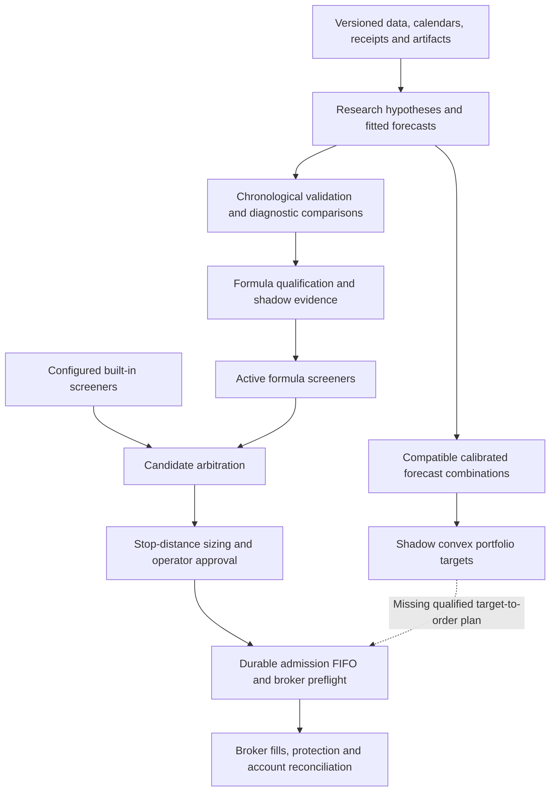

# Alpha stack survey — September 18, 2026

Reviewed implementation: `eb12a7e` (PR #63). This is a source/evidence review,
not a new mining campaign or a change to trading policy. The
[canonical roadmap](alpha-roadmap.md#current-priorities-after-the-whole-stack-survey)
owns subsequent work.

## Assessment

We have substantially better execution safety, causal research and audit evidence.
We do **not** yet have a complete, statistically calibrated path from the newer
panel forecasts to paper portfolio execution. Zero promotions combines genuine
negative evidence, inadequate measured detection power, unavailable source data,
forward-observation requirements and missing deployment capabilities. It cannot
be interpreted as proof that either the market has no opportunities or every
rejection is scientifically justified.

Two days is a poor activation deadline: the current formula path requires 20
observed shadow dates and 10 triggered decisions per symbol. Those requirements
are not met by elapsed wall time or diagnostic captures. For a 20-session target,
20 daily forecasts also do not supply 20 independent realized holding periods.

Zero active **mined** alphas does not mean the desk cannot suggest trades: the
configured built-in trend-pullback and squeeze-breakout screeners remain enabled.
The earlier profitable trades do not validate the new mining process.

## What has been accomplished

- Tests isolate production storage and credentials and block external I/O. Dry scans
  isolate storage, orders and Telegram, while retaining configured market-data/LLM
  access. Broker positions, actual fills and reconciled account activities govern
  reported financial results.
- Entry reservations/FIFO, exact-ID recovery, exclusive closes, stop replacement
  checks, event projections, transactional notifications, readiness and transport
  deadlines cover important failure and race cases.
- Formula research now has versioned definitions, purged chronological evaluation,
  a shared bracket/return engine, consumed holdouts and explicit activation evidence.
  Divergent legacy retuning and uncalibrated Kelly sizing were retired.
- Session replay/observations distinguish exchange clocks, actual receipts and
  unavailable minutes. Raw provider pages reveal supplier versus normalization loss.
- Native-daily studies share bounded acquisition, journal accounting, immutable
  inputs, complete comparison matrices and explicit unknown outcomes.
- Equity panel forecasts use causal feature eligibility within a frozen current
  cohort, mature training labels, training-only scaling and frozen baskets. Source
  controls reproduce the results independently;
  stronger endpoint requirements withhold returns rather than alter past decisions.
- Typed forecasts, calibration uncertainty, combination primitives and a constrained
  convex allocator exist. Their current role is research/shadow, not order authority.

## Current architecture and its missing connection

| Layer | Implemented | Material limit |
| --- | --- | --- |
| Discovery | Catalog, random and typed genetic search; Ridge/boosted benchmarks; panel studies | Production schedule still mines ETF32; equity campaigns are manual |
| Validation | Purging, target contracts, whole-calendar IC/HAC in panel studies, costs and unknown-outcome accounting | Legacy miner objectives/gates are not consistently horizon/dependence aligned; measured power remains inadequate |
| Combination | Explicit forecast units, causal OLS/HAC calibration, clone fences, weighted pooling, residualization | No learned production ensemble; structural differences do not establish economic independence |
| Allocation | CVXPY/Clarabel mean–variance objective, costs/uncertainty penalty, name/gross/group/factor/turnover/participation bounds | CLI/shadow only; no executable rounded plan, partial-fill ownership or risk envelope for pending portfolio orders |
| Live sizing | Dollar risk divided by stop distance, configured caps, macro scaling, tiered suggestions | No joint covariance/CVaR sizing; configured drawdown input is not wired to production |
| Execution/accounting | Atomic reservations, one owner per symbol, exact broker IDs, broker-held protection, reconciled account ledger | No multi-owner book or per-component fill/P&L attribution; broker rejection still determines unsupported funding/borrow cases |
| Operations | Journals, outbox, readiness and source evidence | No single campaign funnel/qualification forecast showing all stage denominators and time-to-maturity |

Keep one evidence/journal infrastructure and the existing execution services. A
research variant deserves a versioned semantic contract, not another broker queue,
standalone simulator or compatibility fallback. The many dated study reports are
useful evidence; their historical recommendations must not compete with the current
roadmap.

## What zero promotions actually tells us

### Real negative evidence

The ETF entry, sector-panel and persistent-book campaigns found unstable or
cost-sensitive economics. The latest equity Ridge result is more promising, but
simple volatility scores have higher mean Rank IC in all three years. Four of
Ridge's 2023 baskets have unknown strict endpoints; its remaining historical
performance is concentrated and current-cohort conditioned.
[Matched-control results](alpha-forecast-controls-2026-09-18.md).

### There is evidence of inadequate gate power

The completed [1,952-job synthetic study](alpha-timeline-study-2026-09-16.md), using
its frozen 7,065-attempt lifetime approximation, accepted **0/64 planted cases in each
of four lifetime-gate groups**. This is not a calibration of today's exact
7,826-count/variance configuration. The holdout-only
alternative accepted 12–28/64, still below its predeclared detection requirements.
This does not identify one guilty threshold, nor justify accepting an inspected
winner. It requires an ablation separating predictor quality, search selection,
execution conversion and each rejection gate on fresh synthetic streams.

The legacy miner computes default one-bar close-to-close temporal IC while genetic
fitness optimizes multi-period bracket Sharpe; qualification requires both. Residual
novelty additionally uses ordinary correlation significance without serial-dependence
correction, even when forward returns overlap. These differ from the newer panel
IC/HAC contract. See `research/alpha/miner.py`, `promotion.py`, `validation.py` and
`orthogonalization.py`.

The **7,826 recorded attempts are not 7,826 independent economic hypotheses**.
They include metadata/feed checks and repeated model/year/cost/source comparisons.
The global count informs qualification alongside a narrower variance family.
Preserve the full ledger, but calibrate a versioned mapping from research families
and adaptive selections to statistical evidence. Do not reset history, equate
cost scenarios with independent discoveries, or claim an estimated effective count
is automatically valid. The [original DSR paper](https://www.davidhbailey.com/dhbpapers/deflated-sharpe.pdf)
addresses selection and non-normality; it does not certify our chosen gate's power.

### Promising panel models do not yet have an activation lane

A fitted multi-stock, adjusted-price model is not a raw-price per-symbol bracket
formula. It needs prospective model/basket records, consistent training/evaluation
labels, an explicit portfolio policy, untouched confirmation and executable plan
semantics. Another threshold change cannot supply those capabilities.

## Concrete findings to address

### S1 — Live drawdown enforcement is disconnected (high priority)

`TradingCopilot.scan()` calls `RiskEvaluator.evaluate_candidate()` without
`current_drawdown_pct`; its default is zero. The sole production call passes only
exposure, LLM choice and active positions. The configured 3% haircut/6% sizing halt
therefore does not engage through this path. `reservation_rejection()` has no
account drawdown rule either. This is a wiring defect, not merely a missing advanced
optimizer. Isolated sizing tests with explicit drawdown do not cover it.

Use one persisted, cash-flow-aware account/mandate risk snapshot with observed equity,
explicit high-water-mark semantics and freshness. Inject it into both sizing and
final admission; revalidate before submission. Preserve configured capital limits
as mandates rather than silently replacing them with broker cash. Test deposits,
withdrawals, unrealized losses, restart, stale evidence and simultaneous approvals.
Source: `agent/copilot.py:430`, `agent/evaluator.py:211`,
`agent/position_sizing.py:53`, `execution/admission.py`.

### S2 — Scheduled acquisition/accounting still diverges

Legacy `alpha mine` downloads/saves bars before reserving an attempt, and `alpha test`
fetches before excluding inspected intervals. The new daily workflow freezes and
charges before reads. Consolidate the scheduled path before increasing cadence;
preserve existing failure journaling and avoid repeatedly re-mining the same seed/window as
if it were fresh evidence. Source: `cli/commands/alpha.py:210`, `:367`,
`scripts/launchd.sh:103`.

### S3 — Live risk is narrower than its labels suggest

`volatility_targeted` sizing is stop-distance dollar-risk sizing, not covariance-based
portfolio volatility targeting. The live path has notional/class/name/count limits
and configured correlation groups, but no aggregate stop-risk budget, hard portfolio
volatility cap or tail-loss constraint. A stop distance is not a gap-loss bound.
Fresh preflight reads clock/trade/orders/positions; it does not acquire a fresh
buying-power/asset-borrowability snapshot. Add those observations to the shared risk
boundary before broadening tradable stock exposure.

The convex allocator already offers useful primitives, including optional factor
constraints and diagonal covariance shrinkage. Still missing are an observed factor
risk/cost pipeline, empirically estimated forecast dependence, borrow costs and an
executable risk-checked plan. Its variance **penalty** is not a hard volatility cap.

### S4 — Existing CVaR reporting must not be mistaken for protection

CVaR currently appears in legacy backtest Monte Carlo reporting, not live admission
or the convex objective. A pure synthetic probe with thirty +1% trades reports
VaR loss 0% but CVaR loss **+1%**, because the implementation takes the absolute value
of the positive lower-tail return. Trade-count-based Sharpe annualization also lacks
an observed time basis; IID trade resampling omits serial and cross-position dependence.
Correct the report's units, sign and sampling assumptions before any policy reuse.
Source: `backtest/monte_carlo.py:73`, `:97`.

A useful future scenario CVaR limit bounds average modeled loss in the selected worst
tail and is amenable to convex formulation. Its credibility depends on aligned joint
scenarios, costs and stress coverage, not on solver success. It does not guarantee
protection against losses absent from those scenarios.
[Rockafellar–Uryasev](https://sites.math.washington.edu/~rtr/papers/rtr179-CVaR1.pdf).

## How to widen the funnel usefully

1. **Reach the universe already available.** The actual funnel is 300 metadata
   candidates →150 eligible under the IEX screen →64 researched equities. The other
   86 eligible names were capped out, not rejected for bad alpha. Acquisition supports
   500, but liquidity/forecast cohort bounds remain 64. Add a separately versioned,
   tested 150–300-name daily forecast path, preserving older contracts and causal
   missing-member handling. A larger current cohort still is not point-in-time history.
2. **Evaluate delayed consolidated daily data explicitly.** Alpaca documents historical
   SIP access with `end` at least 15 minutes old; previous local probes succeeded.
   That delay may suit after-close forecasts for next-session trading. Compare a
   frozen SIP daily contract with IEX, including volume/label coverage and receipts;
   do not silently substitute feeds or assume daily OHLC is an executable auction.
   [Alpaca FAQ](https://docs.alpaca.markets/us/docs/market-data-faq).
3. **Widen economic information before expression count.** Predeclare market/sector-
   residual momentum, liquidity-conditioned reversal and overnight-versus-session
   components, each with matched simple controls and economically appropriate costs.
   Add panel rank/group/residual DSL operators only with observed group membership
   and causal alignment tests. Earnings/fundamental features require publication-time,
   revision and corporate-action evidence first.
4. **Search for marginal portfolio value.** Evaluate whether a feature improves a
   frozen ensemble after costs and exposures, not just its standalone IC or syntax
   novelty. Keep causal train-only combination weights and independent confirmation.
   [AlphaGen](https://arxiv.org/abs/2306.12964) explicitly optimizes combination value;
   [AlphaForge](https://arxiv.org/abs/2406.18394) studies generation plus adaptive
   combination. These motivate bounded benchmarks, not a promise of transferable edge.
5. **Improve search only against matched baselines.** Genetic search already exists.
   Start with economic grammar, diversity and equal-budget comparisons versus random
   search and regularized linear models. [AlphaCFG](https://arxiv.org/abs/2601.22119)
   is a recent grammar/MCTS approach worth a later benchmark. New RL/MCTS engines and
   options/futures rank below the current data, validation and execution gaps.
6. **Collect prospective evidence now.** Daily frozen forecasts and eventual labels
   should accumulate while gate calibration runs. Refresh outcomes daily; run bounded
   discovery on a declared cadence when new data or hypotheses exist. Re-running the
   same history more often does not create independent evidence. Point-in-time
   historical membership is necessary for historical claims, not a reason to postpone
   honest prospective observations of today's explicitly observed cohort.

## Optimization priorities

The right near-term design is calibrated compatible forecasts → one persistent,
cost-aware target book → hard risk checks → one versioned execution plan. Mean–variance
with uncertainty, realistic costs and enforceable bounds is sufficient for a first
credible small experiment. Add factor-risk constraints and observed costs before
more elaborate tail models. CVaR/MPC and impact scheduling should address a measured
shortcoming. Convex optimization allocates forecasts; it does not create predictive
information. [Boyd et al.](https://web.stanford.edu/~boyd/papers/cvx_portfolio.html),
[Markowitz at Seventy](https://web.stanford.edu/~boyd/papers/markowitz.html).

Progress should be visible in a single stage report: distinct economic families,
coverage-complete candidates, fold/cost/incremental passes, uncertainty and power,
consumed confirmation windows, prospective dates and matured horizons, qualified
policies and executable plans. Report rejection reasons and unavailable evidence
separately. Pass quotas and raw trial counts are poor objectives.

## Review verification and limits

Three independent source reviews plus root call-graph inspection; official papers
and Alpaca documentation checked. Pure offline probes reproduced S1's omitted
argument and S4's all-positive-tail inconsistency. No new market-price acquisition,
mining, qualification, activation, broker mutation or Telegram message occurred.
The fixes above remain **open**; this documentation does not assert they are deployed.
Prior PR #63's 1,750 passing tests and 278 integration cases establish useful existing
coverage, not proof that these newly identified missing contracts are implemented.
