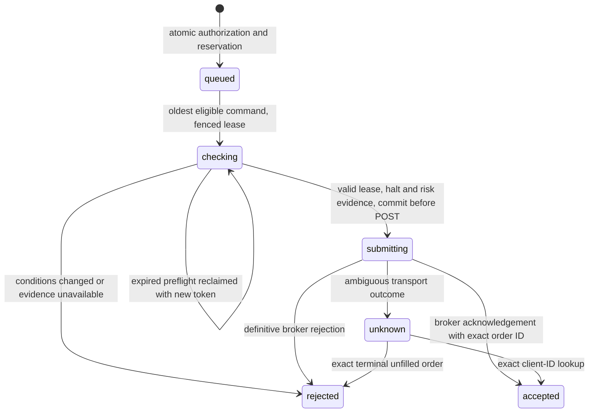

# Durable execution and delivery

Schema **005_execution_workflows** adds a PostgreSQL-backed command queue, a
versioned append-only journal, rebuildable broker-order views, and a transactional
notification outbox. SQLite is an explicitly selected test/development backend.
This document describes source behavior; deployment must be verified separately.

## Boundaries and patterns

- `execution/admission.py`: pure risk/reservation policy.
- `execution/entries.py`: injected entry application service; no Telegram rendering.
- `execution/durable.py`: shared workflow vocabulary and immutable DTOs.
- `storage/workflow.py`: transactional repository, scope locks, fenced claims,
  journal append and projection updates. It performs no network calls.
- `broker/alpaca.py`: official SDK requests, bounded transport, authoritative order
  observations, quote/session/portfolio evidence and exact client-ID recovery.
- `notifier/outbox.py`: delivery consumer. It cannot submit or replay a trade.
- `diagnostics/readiness.py`: passive, current-run freshness assessment.

`TradingCopilot` composes these services; callers can inject entry/close services,
notifier, outbox, broker and storage. CLI and Telegram use the same entry queue.
One daemon owns polling; independent CLI processes can safely help drain entries.
Entry and notification consumers run independently so a slow notification cannot
hold the execution worker. Short database transactions never span remote calls.

This is **bounded event sourcing for broker order views**, plus a transactional
inbox/outbox for application workflows. It does not claim every legacy signal,
portfolio calculation or account balance is event sourced. `domain_events` financial/workflow evidence is
append-only through its repository; redundant old healthy observations have a
[bounded compaction exception](operational-monitoring.md#retention-contract); normal DB administrative privileges still
allow changes. Event schema version 1 is explicit. `order_projections` can be
reconstructed without broker mutations. Existing `audit_events` remains the
operational trace (commands, HTTP outcomes, startup revision, valuations).

## Entry state machine



The per-environment/account-mode lock arbitrates reservations across processes.
Position count, total and asset-class notional, per-trade risk/size and configured
correlation groups include `SUBMITTING` reservations. A symbol cannot receive
another entry while held, reserved or closing. Queue order uses database event sequence, independently of client clock ordering.
The FIFO head's claim serializes
entry submissions. This is admission serialization, not a promise that external
broker activity or existing close orders cannot run concurrently.

Before POST, the service rechecks the signal, halt, authorization age, signal age,
broker regular session, current broker positions and working orders, fresh
Alpaca trade price, configured price drift, economic-event lockout and the combined
macro/volatility risk policy. Alpaca admission also refreshes the reconciled
[account risk snapshot](account-ledger.md#cash-flow-adjusted-drawdown-and-entry-admission).
Final submission pins its exact fingerprint under the ledger lock and rechecks the
lease after waiting. Every tier and explicit quantity shares the drawdown cap.
Approval, signal, quote and session deadlines are
checked again after preflight work so a slow admission check cannot use expired
authorization. Existing risk limitations around daily macro feed
age remain; the quote-age check does not certify freshness of all macro feeds.
Unsupported external adapters fail closed until they implement this contract;
local simulation explicitly skips external market checks. Current broker entry
admission supports Alpaca equities; crypto brackets remain unsupported.

An expired or changed approval is rejected with its reason, retained in the
journal and notified. The operator requests `/scan` and approves a new proposal.
No price/quantity is silently changed. The original limit/bracket and client ID
are immutable in the persisted command. `queued` means authorized and awaiting
checks, **not** broker acceptance or a fill. Unknown submissions block the FIFO;
queued approvals behind them expire on their eventual admission check.

Only preflight leases expire. Once `submitting` is committed, no worker may replay
POST, even after a crash or a 404 lookup. Monitoring and the entry worker look up
the original client ID. An ambiguous response persists a halt; successful lookup
does not clear an explicit halt. `/resume` refuses unresolved submissions and
unmapped legacy claims. A confirmed unfilled canceled/rejected/expired entry
releases capacity. Partial terminal entries retain conservative tracking and
require review of actual holdings/protection; they are not invented closed trades.

## Broker order journal and accounting limits

The journal persists cumulative quantity, average fill price, broker update time,
status, order/client/parent IDs, and replacement links. Wire decimal strings are
preserved. Duplicate observations have deterministic keys. Older observations
cannot roll the projection backward; replay preserves known parent links.
WebSocket updates record evidence and wake REST reconciliation. Stream event
price alone never becomes realized P&L.

A history-journal failure degrades readiness and is audited; exact position
reconciliation continues independently. REST reads bounded recent order history (default seven days), open orders, and
exact tracked/nonterminal order IDs, including replacement chains. Saturated or
nonadvancing pagination fails visibly. Broker-only orders are journaled without
inventing a signal or entry cost. This is not a historical import of every account
execution, fee, corporate action or trade correction. Cumulative partial fills remain visible in `db orders`. Schema 006 adds a
[replayable account activity ledger](account-ledger.md) for individual executions,
fees/income and broker-reconciled account P&L. `/perf` keeps tracked full closes
separate. Per-signal partial-exit allocation and corporate actions remain work. Broker-backed sliced execution stays disabled.

## Outbox semantics

Signal creation, confirmed closure, and acknowledged stop changes save their
notification job in the same DB transaction. Entry outcomes do likewise.
Trade handlers return after persistence; they never await Telegram delivery. Other
operational broadcasts enqueue durable messages; interactive command replies
continue using the shared Telegram request transport.

The consumer claims jobs with a fencing token and lease, records attempts/results,
uses bounded exponential backoff, and moves exhausted deliveries to `dead`.
Expired delivery claims can be retried, unlike broker submissions. Delivery has
a timeout shorter than its lease. Unconfigured local notifiers leave jobs for the
configured daemon instead of exhausting them. Telegram request audits carry the
outbox ID for correlation with returned message IDs.

Delivery is **at least once**: Telegram has no transactional commit with PostgreSQL
or send-message idempotency key. A lost acknowledgement or crash after sending
can cause a duplicate notification. Neither scenario repeats the trading action.
There is no Redis/pubsub dependency: one Telegram destination needs a durable
consumer, not another infrastructure tier. Multiple consumers remain DB-fenced.

## Readiness and operators

`/healthz` remains process liveness. `/readyz` returns JSON with HTTP 200 or 503,
using this daemon run's successful reconciliation, scan/gate checks, worker and
Telegram poll observations, event-loop lag, broker WebSocket connection, unresolved
entries, halt and outbox age/dead letters. Idle trading streams do not require
fills to prove freshness. Readiness is operational evidence, not a guarantee of
execution or an open market. Per-entry checks still run independently. Persistent
health observations are throttled; failures/state changes are recorded promptly.

```bash
uv run copilot doctor --readiness     # passive daemon endpoint, nonzero if unready
uv run copilot db queue               # recent entry commands and outcomes
uv run copilot db events --limit 100  # newest journal events
uv run copilot db events --stream order/BROKER_ORDER_ID
uv run copilot db orders              # cumulative order read model
uv run copilot db orders --rebuild    # DB replay only; no orders/messages
uv run copilot db outbox              # delivery attempts and dead letters
uv run copilot db outbox --retry JOB_ID
```

Manual requeue may duplicate a delivered-but-unacknowledged notification. It only
accepts dead letters in the selected environment/account scope. `db clear` refuses
to reset signal identities when events or work exist; use audited quarantine.
Never change brokerage credentials to a different account against the same DB
scope without a reviewed migration; scope uses environment/account mode, and schema 006 permanently binds its
activity ledger to the broker account UUID.

### Configuration defaults

| Setting under `execution` | Default |
| --- | --- |
| `entry_preflight_lease_seconds` | 60 |
| `entry_queue_max_age_seconds` | 120 |
| `signal_max_age_seconds` | 14400 |
| `entry_quote_max_age_seconds` | 60 |
| `entry_max_price_drift_pct` | 0.01 |
| `worker_interval_seconds` / `worker_batch_size` | 2 / 20 |
| `journal_history_days` / `journal_max_pages` | 7 / 20 |
| `notification_delivery_timeout_seconds` / `notification_lease_seconds` | 60 / 120 |
| `notification_max_attempts` | 8 |
| `notification_retry_seconds` / `notification_max_retry_seconds` | 5 / 900 |

Telemetry defaults: reconciliation 180s, Telegram poll 120s, worker 30s, scan 18000s,
notification backlog 1800s, health observation interval 10s. All are configured
under `telemetry`. Match poll audit/health sampling intervals to freshness limits.
A dead letter makes readiness unhealthy. The [external monitor](operational-monitoring.md)
alerts sustained failures and compacts redundant old healthy observations. Financial
and workflow history still require capacity/backup planning; never delete replay or
deduplication evidence.

## Validation and deployment

Tests use real temporary storage, parametrized races/recovery/expiry/replay cases,
and the actual Alpaca SDK with deterministic venue responses. Default integration
transport is real loopback HTTP/WebSocket; PostgreSQL requires `--run-postgres`
and the guarded disposable `TEST_POSTGRES_URL`.

`--alpaca-transport=memory` selects an in-process Requests adapter for the same SDK
application-path tests in a restricted environment. It does **not** prove socket
binding, socket timeout behavior, WebSocket reconnection, or PostgreSQL locking.
Those tests remain mandatory in unrestricted CI before merge/deployment.

Before deployment: run full tests/PG integration/pre-commit, review and merge,
back up PostgreSQL, apply migrations to head, and perform a controlled single-daemon
restart. Verify startup revision/PID, `/readyz`, poll and stream state, fresh
reconciliation, account valuation parity and delivery backlog. No live test order
or synthetic production Telegram message is necessary. Do not downgrade after
work is accepted without a recovery plan: removing the queue destroys uncertainty
and duplicate-submission protection.

### Historical schema 005 verification record

Initial schema 005 validation on Python 3.14 (these are historical counts; use current CI for the latest suite):

- Full default suite: **589 passed, 8 opt-in PostgreSQL skips**.
- Integration suite with `--run-postgres`: **37 passed**, using real loopback
  HTTP/WebSocket and a disposable `test_` database on PostgreSQL 17.11.
- Upgrade from schema 004 preserves existing signals, close intents, halt and audit
  rows. Independent database clients exercise entry reservations and outbox claims.
- Review regressions cover approval/signal/session deadlines expiring during
  preflight, connection health during real SDK WebSocket delivery, lookup-only
  recovery and transaction rollback when notification persistence fails.
- Read-only paper-account probing parsed the current broker orders, including held
  bracket legs. No test order or synthetic production notification was sent.

Pre-commit and CI validate the committed tree. Deployment evidence is separate:
`scripts/verify_runtime.py` checks a clean matching revision and current-run
`/readyz`, broker/report parity and Telegram menu/poll freshness. Runtime startup,
component observations, order events and delivery audits persist in PostgreSQL.

## Timed entry cancellations and holding closes

[Trade lifetimes](alpha-trade-lifetimes.md) reuse these tables and scope locks. `entry_cancel` transitions directly to non-replayable `submitting` before one exact DELETE. Only complete, zero-fill terminal evidence for the persisted group permits `accepted`; ambiguous outcomes become `unknown`, halt new risk and retain their reservation. Independent recovery gives a submitting owner its bounded transport/confirmation window before declaring uncertainty, and never reissues the mutation. Journal projections fence stale snapshots. Both enqueue and pre-POST authorization reject unresolved cancellations.

Holding deadlines invoke `PositionCloseService` with a deterministic identity derived from scope/signal/entry. Existing/failed IDs are never resubmitted. Close claims and changed results append `close_requested`/`close_resolved` plus deduplicated notification intents in the same transaction; identical recovery observations do not append repeated result transitions. Partial/uncertain evidence receives a retained `lifetime_review` event and outbox notice. No additional event bus, queue or schema is introduced.
