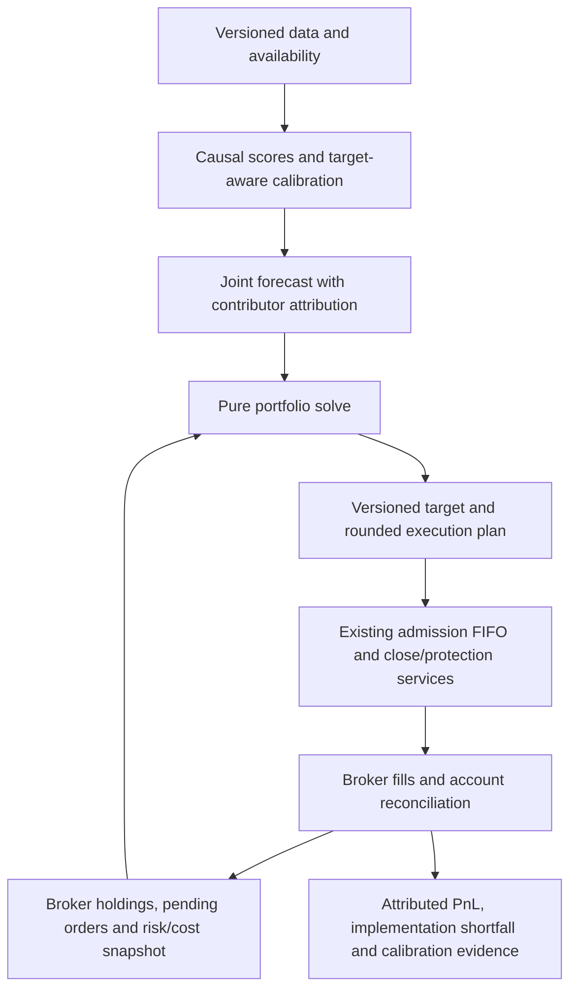

# Forecast-to-fill pipeline review

**Reviewed 2026-09-17 against `09865a5` (PR #52).** Source: the user-supplied
`from-forecast-to-fill-offline.html`, all 15 sections, SHA-256
`cee94f78849653c5a52ee0acef992755c99ea642c05472e1ec34f65a09ebed5d`.
The HTML was read statically, including its mathematical annotations. It is not
vendored here. This is an assessment and implementation plan, not a change to
trading policy or an authorization path for shadow portfolios.

## Remediation status — September 17

[Contract hardening](forecast-contract-hardening.md) fixes trade participation,
calibration boundaries, incompatible forecast/risk units, uncertainty use and cloned
family weighting. It adds immutable solve diagnostics, bounded provider reads and
an exact-feed access probe. The divergent retuner and uncalibrated Kelly mode are
retired; a further minimum-size/hard-gate defect is fixed. The findings below remain
the original review evidence. Executable plans and empirical profitability remain open.

## Conclusion

The tutorial is a useful design reference. Its most valuable contribution for us
is a continuous chain of explicit contracts: **scores → calibrated returns → one
portfolio target → executable trades → measured fills and costs**. We have several
of these parts, but they are not yet one production portfolio pipeline.

Production is an operator-approved, single-owner trade workflow with durable risk
reservations and broker reconciliation. Research has a cost-aware convex allocator,
but its outputs deliberately cannot submit orders. Connecting the two now would
be premature: the review reproduced a participation-limit defect and identified
missing horizon, forecast-error, inventory and execution contracts.

The highest-value research experiment is a **persistent, cost-aware ETF portfolio**
that trades changes in desired exposure, rather than repeatedly liquidating a basket
on a fixed schedule. This could reduce needless turnover; it cannot create predictive
power. The completed panel study still has zero passes, and changing its holding or
cost assumptions requires a new frozen, charged experiment.

## What exists today

| Tutorial stage | Current implementation | Assessment |
| --- | --- | --- |
| Scores and causal validation (§3) | Typed DSL, purged forecast targets, session replay, panel alignment, retained attempts and holdout exclusions | Strong foundations; latest studies remain diagnostic and fail their economic screens. |
| Score → expected return (§3) | `ForecastCalibration` fits shrunk OLS; its miner caller excludes labels crossing the training boundary | Present in shadow. The forecast DTO does not carry the benchmark's explicit `ForecastTarget`. |
| Multiple forecasts (§3) | Shadow inverse-uncertainty pooling; production `ConflictResolver` selects a deterministic owner or drops opposing candidates | Ownership arbitration is not an ensemble or portfolio netting. No production joint forecast allocation. |
| Portfolio risk (§4–6) | Shadow empirical covariance with diagonal shrinkage; optional factor-exposure, gross, group, name and turnover bounds | Useful QP foundation. Production uses trade/aggregate notional and risk caps plus correlation checks, rather than joint covariance allocation. |
| Costs and allocation (§7) | Clarabel objective: expected return minus covariance risk penalty minus linear cost on weight changes | Already implemented in research. Participation is misapplied to holdings, and uncertainty is not used in the objective. |
| Robust forecasts and tail risk (§8–9) | No forecast-error covariance or CVaR model in allocator | Deferred extensions, after units and estimation are reliable. A risk penalty is not a hard volatility ceiling. |
| Sizing (§10) | Live configuration is `static`, driven by stop distance and configured risk capital; optional Kelly-named multiplier | Explicit mandate caps are useful. The optional multiplier is not calibrated Kelly allocation. |
| Execution (§11–12) | Entry FIFO, atomic reservations, exact client IDs, close intents, conditional updates, protection, event journal and outbox | Stronger operational semantics than a mathematical tutorial supplies. Target-to-order plans and shared-position attribution are still missing. |
| Diagnostics (§14) | PSD/alignment checks, solver status and independent post-solve primal checks; immutable study artifacts | Missing full solve certificates, target-to-fill attribution and a durable end-to-end allocation snapshot. |

Code anchors: [scan orchestration](../agentic_trader/agent/copilot.py),
[candidate arbitration](../agentic_trader/screeners/registry.py),
[forecast calibration/pooling](../agentic_trader/research/alpha/forecasts.py),
[shadow observations](../agentic_trader/research/alpha/shadow.py),
[explicit benchmark targets](../agentic_trader/research/alpha/targets.py),
[portfolio builder](../agentic_trader/research/alpha/portfolio.py),
[convex optimizer](../agentic_trader/research/alpha/optimizer.py),
[sizing](../agentic_trader/agent/position_sizing.py), and
[entry admission](../agentic_trader/execution/admission.py).

The live configuration enables scheduled parameter retuning and uses SIP. At the
end of PR #52 the alpha registry had zero active and ten shadow versions. Built-in
screeners remain a separate source of suggestions; zero active mined alphas does
not mean all signal generation is disabled.

## Findings and concrete counterexamples

### F1 — Participation limits constrain the wrong quantity

**P1 before portfolio execution; shadow defect, not a current broker-order bypass.**
`PortfolioSnapshot.liquidity_caps` describes available trading notional, but the
builder converts it to an absolute bound on the final holding. Participation must
bound the change in inventory over its declared execution window.

A pure synthetic solve with $100,000 NAV, an existing $10,000 short, a $5,000
liquidity allowance, a +2% forecast and the default policy returned a +$5,000 target.
The required purchase is **$15,000**, three times the allowance. It reported success
and 15% turnover, which fits the separate 20% total-turnover bound.

Use separate holding limits and per-symbol trade limits. Do not silently force
liquidation of an existing holding merely because today's participation budget is
smaller. Emergency liquidation requires an explicit policy and observable exception.

### F2 — Timeframe is not a return horizon

**P1 before meaningful allocation comparisons.** `AlphaForecast` and
`CombinedForecast` carry a bar timeframe, not the number of bars, return label,
entry/exit endpoints, feed/clock identity or price basis. The portfolio builder accepts
daily return observations alongside a forecast marked `1h`; the synthetic solve
succeeded. It also cannot distinguish one-day from five-day forecasts based on
daily bars. Its error text promising one calibrated horizon overstates the check.

Reuse and extend `ForecastTarget`; carry immutable calibration/training-cutoff,
availability/expiry and data identities. Give the covariance and cost snapshot
explicit units, sampling/holding horizon and observation cutoff. Reject incompatibility
before solving. Date ordering alone does not establish matching units or freshness.
Do not automatically annualize or multiply daily covariance by a horizon without
declaring the serial-dependence assumption.

`ForecastCalibration.fit()` treats `trained_until` as metadata. Its present miner
caller supplies purged training slices; this review did **not** establish a new
lookahead defect there. A reusable calibration boundary should validate outcome
availability itself, so correctness does not depend on every future caller remembering
that convention.

### F3 — Return volatility and forecast uncertainty are different objects

**P1 contract gap; robust optimization itself can follow later.** The shadow observer
sets forecast `uncertainty` from calibration `return_volatility`. That measures
variation in outcomes, not estimation error in the forecast mean. Pooling uses
inverse uncertainty, while the portfolio builder discards the field entirely.
Changing a combined forecast's uncertainty from 0.01 to 100 produced identical
weights in the synthetic solve; source inspection confirms no objective dependence.

Represent return covariance (`Σ`), estimated forecast-mean error (`Ω`) and uncertainty
in reported IC separately. Initially use causal shrinkage/calibration with honest
unavailable estimates. Later evaluate a penalty such as `κ sqrt(wᵀΩw)` against a
frozen baseline. Do not put raw return volatility into that term and call it forecast
confidence; do not interpret a statistical t-value as a capital allocation rule.

### F4 — Duplicated alpha families can change the pooled forecast

**P1 for multi-alpha research, while execution remains gated.** Version-ID duplicate
rejection and conservative pooled uncertainty do not model dependence between
different versions. Equal-weight +1% and −1% forecasts combine to zero. Adding a
new version that copies the +1% forecast changes the result to **+0.3333%**, without
adding information.

Use causal residual/forecast dependence estimates, family exposure limits and
regularized blending; retain contributor attribution. Test the incremental benefit
of a component to a frozen ensemble, not only its standalone trade Sharpe. A distinct
combined strategy must version its contributors, weights and execution policy and
pass the existing qualification process. Avoid treating independent version IDs,
tickers or repeated parameterizations as independent breadth.

### F5 — A target portfolio is not yet an executable plan

**Existing P1 execution gate, reaffirmed.** The builder adds worst-case reservations
to actual holdings and treats that sum as current inventory for both turnover and
costs. Conservative reservation exposure is useful for admission, but is not a filled
position from which execution costs can be measured. Keep filled inventory, pending
orders and their possible completion states separate.

The maximum-position heuristic preserves existing owners, then selects names by
absolute expected return. It can exclude hedges and replacements even if a solve
would close an incumbent. This is a restricted-support heuristic, not a globally
optimal cardinality-constrained portfolio. Evaluate deterministic support swaps or
a small integer formulation only when needed, with explicit solve limits.

Before execution, require target revision fencing, price/lot rounding, cash and
buying-power checks, order/protection ownership, close-before-reverse semantics,
partial-fill attribution and risk checks over intermediate reachable positions.
Do not send optimizer deltas directly to Alpaca or create a second order queue.

### F6 — Solver feasibility is checked; optimality and explanations are incomplete

**P2.** Keep the current finite/PSD/axis checks and independent primal feasibility
checks. Extend results with objective decomposition (return, risk, costs), covariance
conditioning, named constraint slacks/duals, solver/version/tolerances, elapsed time
and available residual/gap diagnostics. Record the exact forecast, risk, cost and
account snapshot hashes in the existing artifact/journal system.

The current `alpha portfolio` CLI reads explicit JSON and prints a result; it does
not itself persist a complete allocation decision journal. A generic `optimal`
status cannot explain whether risk, turnover or forecast scaling drove a result.
[CVXPY exposes dual variables and solver statistics](https://www.cvxpy.org/tutorial/solvers/index.html#solver-stats),
although available statistics depend on the solver. Use the existing Clarabel stack;
a new optimizer framework is unnecessary.

### F7 — A legacy simulator still diverges from the hardened research path

**P1 before trusting scheduled retuning reports.**
[ParameterGridOptimizer](https://github.com/adamhadani/agentic-trader/blob/366a5b8/agentic_trader/research/optimizer.py) and
[AutoRetuner](https://github.com/adamhadani/agentic-trader/blob/366a5b8/agentic_trader/research/retuner.py) retain a separate NumPy simulation
and an optional VectorBT path with different stop assumptions. The NumPy branch adds
the entire accumulated unrealized P&L to the preceding equity value each bar, then
adds the full realized P&L on exit.

Reproduction: close prices `[100, 101, 101, 103]`, highs/lows ±0.01, ATR 1,
one initial long entry, 50 shares, stop 98.5 and target 103. Actual profit is $150.
The simulator reports **$250**, or 0.25% on its $100,000 starting capital, instead of
0.15%. This is accounting error, not a model assumption.

Scheduled retuning is enabled in the reviewed configuration. It writes calibration
JSON and a summary; no automatic screener consumer of that JSON was found. Manual
configuration export exists. The recent alpha/session/panel studies use other paths,
so this defect does not explain their failures or contaminate broker-reported P&L.

Retire or quarantine the divergent retuning engine, then migrate useful searches to
shared execution/return accounting and trial recording. Add exact equity-path tests
before trusting WFE or OOS rankings. Do not repair just this arithmetic and leave
different fill/stop/timeframe conventions masquerading as equivalent engines.

### F8 — The optional Kelly label overstates the sizing model

**P3; current sizing is static.** The multiplier uses configured baseline win rate
and requested reward:risk, rather than a calibrated outcome distribution. A negative
binary-Kelly edge returns a 0.5 multiplier. At the default baseline, changing the
fraction from half to full leaves the multiplier at 1.0 because numerator and baseline
denominator scale together. Treat it as a bounded heuristic or remove/rename it until
supported by causal payoff estimates. Requested bracket distance is not realized
payoff odds; risk capital policy can legitimately dominate a sizing model.

## What to adopt from the tutorial, and what to qualify

1. **One combined book, one risk/cost model.** Component forecasts should influence
   a shared portfolio target; competing per-alpha screeners cannot provide the same
   trade netting or correlated-risk treatment. Keep the current single-owner execution
   boundary until ownership and protection are explicit.
2. **Trade only when benefit exceeds friction.** Linear costs naturally create
   no-trade regions around existing inventory. Start with a persistent single-period
   policy and measured spread/slippage; defer multi-period model-predictive control
   and child-order scheduling until there is evidence of need. This follows the
   single/multi-period formulation in
   [Boyd et al., Multi-Period Trading via Convex Optimization](https://web.stanford.edu/~boyd/papers/cvx_portfolio.html).
3. **Match score, return and risk units.** The tutorial's `alpha = IC × sigma × z`
   regression identity uses Pearson correlation under its standardization assumptions.
   Our Spearman Rank IC measures monotonic association, not that regression slope.
   Estimate a causal return calibration rather than substituting 0.03 into the formula.
   See [SciPy's Spearman definition](https://docs.scipy.org/doc/scipy/reference/generated/scipy.stats.spearmanr.html)
   and our [IC contract](alpha-information-coefficient.md). Annualized ICIR and t-stat
   benchmarks still need compatible sampling units, dependence and multiple-search controls.
4. **Separate neutralization from final portfolio constraints.** Residualizing scores
   does not guarantee zero final beta after covariance weighting, costs and bounds.
   Weighted regression neutrality is also different from unweighted dollar neutrality.
   With nine sector ETFs, one separate industry dummy per ETF would remove essentially
   the entire cross-sectional signal. Choose exposures consistent with the economic
   hypothesis instead of automatically neutralizing what we want to trade.
5. **Missing data is a state, not a zero.** Distinguish no forecast, stale/unavailable
   inputs, cannot trade, cannot hold and cannot short. Zero expected alpha can be a
   deliberate no-view assumption after validation; it is not permission to replace
   missing observations before normalization or optimize through an outage.
6. **Optimize the model without overstating it.** Convexity establishes a global
   solution to the stated problem, subject to numerical accuracy. It does not establish
   predictive power, correct inputs, feasible brokerage execution or research/live parity.
   Cardinality, lots and fixed costs add discrete decisions; the
   [MOSEK transaction-cost models](https://docs.mosek.com/portfolio-cookbook/transaction.html)
   make that distinction explicit. Reject infeasible safety constraints; only explicitly
   declared preferences may become soft constraints with recorded slack.
7. **Keep extensions proportionate.** Factor risk decomposition and shrinkage deserve
   evaluation; dense-matrix speed is not our bottleneck for nine/32 ETFs. CVaR scenarios,
   forecast-error robustness, risk parity, impact scheduling and MPC are useful later
   experiments, not prerequisites for the first credible small paper portfolio. Kelly
   examples and reward:risk ratios do not justify increasing capital limits.

Cost-horizon consistency is essential, but amortizing an optimization coefficient
must never discount actual paid backtest fees. Nor does a scenario Kelly constraint
protect against losses absent from the supplied scenarios. Preserve gap, borrow,
corporate-action, funding and terminal-liquidation assumptions explicitly.

## Target architecture: reuse the existing boundaries

Immutable domain values describe forecasts, risk/cost snapshots and plans. Injected
application services acquire inputs, persist evidence and coordinate existing broker
workflows; pure functions calibrate, combine and solve. CLI and Telegram only render
the shared report. Use existing event/artifact/outbox mechanisms, with versioned event
types as needed, rather than a parallel portfolio database or execution bus.

Measure signed fill-versus-decision-price implementation shortfall separately from
forecast error, delay, spread, fees/borrow and missed/unfilled opportunity cost. Broker
account P&L remains authoritative; per-alpha attribution requires explicit ownership
and is not inferred from symbol-level cash flow.

## Ordered implementation and acceptance plan

The [canonical roadmap](alpha-roadmap.md#forecast-to-fill-follow-up) owns sequencing.
This table defines the acceptance boundaries, not a second independent backlog.

| Order | Work and use case | Acceptance / principal risk |
| --- | --- | --- |
| 1 | Data entitlement/freshness and real transport deadlines; contain F7 before further scheduled retuning | Doctor reports unavailable recent SIP explicitly; no substitution of IEX identity or synthetic completeness. Timed-out reads cannot block the event loop or monopolize executor capacity. Exact retuner equity-path regressions and no trusted reports from the defective path. |
| 2 | Lossless raw/normalization evidence and the retained SPY-minute postmortem | Supplier omissions and cleaning losses are distinguishable without replacing frozen failed evidence. Preserve receipts, revisions and every inspected interval. |
| 3 | Target-aware forecast/risk/cost contracts, F1/F2/F3, solver evidence | Same-bar/different-horizon inputs reject; trade participation holds for increases, reductions and reversals; filled inventory and reservation envelopes remain separate. Unavailable forecast-error estimates are explicit. |
| 4 | Frozen persistent ETF portfolio experiment and causal combination, F4 | Predeclare a small hypothesis/turnover matrix; charge every comparison. Compare fixed-basket, persistent cost-aware and no-trade controls on purged folds. Include nulls, planted edge, duplicate/opposing/complementary components and concentration/turnover/borrow/cost stress. Retain full fees, terminal inventory and mark-to-market paths. |
| 5 | Rebalance plan and paper execution gate, F5 | Dry preview reproduces targets; rounding and partial fills cannot exceed hard constraints or leave protection/ownership ambiguous. Stale or changed snapshots invalidate plans. One original client ID resolves ambiguous submissions. Broker account/attribution reconciliation and operator explanations agree. |
| Later | Factor models, robust mean, hard volatility/tail caps, MPC, capacity-aware scheduling | Add only against measured shortcomings and declared mandates. A profitable diagnostic does not bypass qualification, forward evidence or execution gates. |

### Test strategy

- Parametrize target/label/feed/clock/freshness and liquidity boundary cases. Future
  price/label perturbations must not affect earlier fitted forecasts or covariance.
- Use analytic one-asset cost-threshold and unconstrained quadratic optima, asset
  permutation and consistent objective-scaling tests. Existing tests already cover
  permutation, invalid covariance and basic cost dampening; extend rather than duplicate.
- Compare objective values with a second solver on bounded fixtures; weights may
  differ under non-unique optima. Check primal/dual feasibility, stationarity and
  complementarity at meaningful scale, including infeasible and timeout cases.
- For a fixed feasible set and scalar linear-cost coefficient, increasing that cost
  should not increase optimal total turnover. With zero costs, current holdings can
  still matter through turnover constraints; do not copy the tutorial's unqualified
  independence test.
- Replay actual SDK HTTP/WebSocket and disposable PostgreSQL cases through the
  existing FIFO/close/journal: competing plans, stale account data, partial fills,
  cancel races, lost acknowledgments, restart and late responses. Unit solver tests
  cannot prove these contracts. Inspect transient risk, not just final weights.
- Snapshot every diagnostic solve and every eventual plan, with redacted operator
  explanations: why no trade, binding limits, expected cost, actual fill deviation and
  contributor attribution. Do not retry an order to recover a report or notification.

## Review evidence and limits

- Isolated worktree; no runtime source/configuration changes, promotion, order or
  synthetic Telegram message. No new market-data research trial was conducted.
- **36 existing tests passed** across forecast pooling, portfolio construction and
  optimizer safety/behavior. The counterexamples above were separate pure offline
  probes against the reviewed revision, not newly passing regression coverage.
- Probe covariance fixture: one symbol, 60 consecutive daily timestamps ending
  `2026-09-17T12:00:00Z`, alternating −1%/+1% returns; default `PortfolioPolicy`,
  $60,000 group cap, tradable/shortable, no locks/reservations. Other probe inputs are
  stated beside each finding. No credentials, providers, DBs or notifiers were used.
- Tests passing do not negate the reproduced gaps. The next implementation should
  first encode them as failing behavioral tests. Actual broker mutation/PG integrations
  were not rerun for this documentation-only assessment.
- Separately, read-only runtime verification at **2026-09-17 11:43:49 UTC** passed
  all 17 readiness checks on `09865a5`: Alpaca paper identity, broker/report position
  agreement, current accounting, Telegram identity/menu/polling and worker freshness.
  Poll age was 2.47 seconds and observed loop lag 1.75 ms. Exactly one launchd daemon
  remained registered/running. Private verification SHA-256:
  `119df206abde76ead3471083d0982e942dc884b7e8b03042d5086cb0a01f280e`.
  This does not clear the separate recent-SIP prerequisite below.

### Operational prerequisites carried forward from PR #52

The [deployment verification](https://github.com/adamhadani/agentic-trader/pull/52#issuecomment-5713653343)
recorded healthy broker/Telegram/account checks but six startup data timeout/fallback
warnings and a recent-SIP entitlement rejection. A delayed SIP read succeeded. These
are different facts: a healthy worker cannot make unavailable recent data complete.
[Alpaca documents the recent-SIP subscription requirement](https://docs.alpaca.markets/us/docs/market-data-faq).
Do not silently switch a version's feed or backdate delayed observations.

Source review also found that the synchronous fallback's executor context waits for
a timed-out task during shutdown, and its async wrapper can call a synchronous
function inline. Default market-data SDK construction bypasses the bounded transport
already used by the broker. Consolidate that transport boundary and test real deadlines;
another per-command retry shim would preserve the underlying problem.
