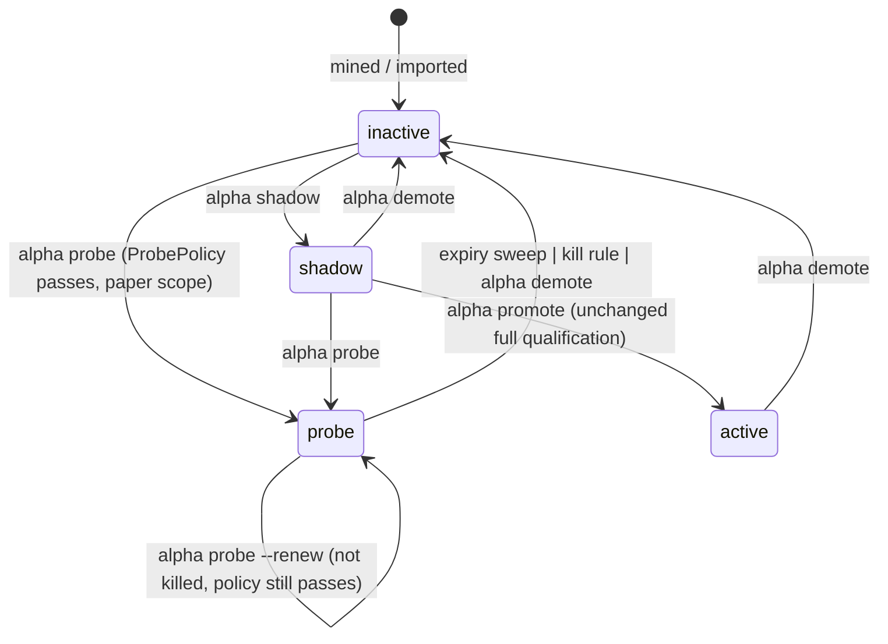

# Alpha paper-probe (incubation) lane — design

Status: proposed, September 21, 2026. Sub-project A of three (A: paper probe,
B: allocator-sized signals, C: mining-funnel fixes). B and C get their own specs.

## Problem

The per-symbol live path is complete: active formula alpha → scan candidate → LLM
evaluation → Telegram card with sizing tiers → durable FIFO admission → Alpaca
bracket order → reconciliation. Nothing mined can enter it. `active` requires a
passing qualification plus 20 shadow sessions and 10 decisions; the measured gate
power against a planted signal is 0/64 ([power diagnosis](../../alpha-power-diagnosis-2026-09-18.md));
and holdout consumption is keyed by symbol alone, so one qualification attempt by
any alpha locks that symbol for roughly one holdout length (about a year at a
five-year lookback). The pipeline therefore cannot be exercised end to end with
mined alphas, and execution/data-alignment defects stay hidden.

## Goal and non-goals

Let an operator enrol a mined alpha that clears a relaxed, versioned bar into a
time-boxed, risk-capped, clearly tagged **probe** that trades through the existing
path on the Alpaca **paper** account only.

Non-goals: changing `ValidationPolicy`, the meaning of `active`, or any live-scope
behaviour; portfolio sizing (B); funnel or holdout-accounting changes (C); automatic
enrolment; any new queue, table, daemon or Telegram poller.

## Precedent

This is the standard incubation stage of a strategy lifecycle (time-boxed, small
capital, explicit kill criteria) and the canary stage of a staged model registry,
where `shadow` already plays the score-but-do-not-act role. Staging is isolated by
environment: every alpha projection row is scoped `{environment}/{execution_mode}`
and the Alpaca mode is suffixed `:paper` or `:live` (`storage/db.py`,
`storage/workflow.py`), so paper and live registries never share state.

## State machine

Status is a pure function of journaled state and the clock:
`status(version) = f(registry, probe/{version}, now)`. No timer is required for
correctness; the sweep below only makes a derived fact durable and visible.

Every state has an exit, and no transition depends on in-memory state:

| State | Produces orders | Exits |
| --- | --- | --- |
| inactive | no | shadow, probe |
| shadow | no (forecast observations only) | probe, active, inactive |
| probe | yes, capped, paper scope only | renew, inactive |
| active | yes | inactive |

A killed version is terminal for that version: neither renewal nor fresh
enrolment is accepted, because the forward record is measured from
`first_enrolled_at`, which survives retirement. A newly mined version is a new
identity.

`probe → active` is deliberately absent. A probe that performs well keeps trading
by renewal; `active` stays reachable only through statistical qualification, so
its meaning is unchanged. A version is in at most one of `active`, `shadow`,
`probe`; the one-current-version-per-`alpha_id` supersession loop covers all three.

Orthogonal state is unaffected and needs no new transitions:

- **Signals.** A `PENDING` signal whose alpha leaves `probe` is rejected at enqueue
  or at `begin_submission` with a stated reason, then ages out normally.
- **Positions.** An open position whose alpha leaves `probe` keeps its broker-held
  bracket and remains closable through `PositionCloseService`. Leaving `probe`
  never closes, cancels or modifies anything at the broker.
- **Halt.** Probes obey the trading halt exactly as active alphas do.

## Components

### 1. `ProbePolicy` (`research/alpha/probe.py`, new)

A frozen, versioned dataclass, separate from `ValidationPolicy`:

| Field | Default | Meaning |
| --- | --- | --- |
| `version` | `probe_policy_v1` | Identity pinned into every enrolment |
| `min_holdout_sharpe` | `0.0` (strict `>`) | Holdout Sharpe floor |
| `min_cost_stressed_return_pct` | `0.0` (strict `>`) | Cost-stressed holdout return floor |
| `min_holdout_trades` | `5` | Closed holdout trades |
| `max_term_days` | `180` | Upper bound for `--days` |
| `kill_r` | `-4.0` | Cumulative realized R at which a probe stops signalling |

`assess_probe(qualification_document, policy) -> ProbeAssessment` is pure. It reads
the **stored criterion observations** of an existing qualification decision
(`qualification/{version_id}`, written by `alpha qualify`) and never recomputes or
re-reads price data, so enrolment consumes no holdout and charges no trial. It
fails closed: a missing, errored or non-finite observation is a rejection reason.

Structural requirements, identical to promotion: `timeframe == "1d"`,
`clock is None`, `data_feed in ("alpaca:iex", "alpaca:sip")`, the deployment-feed
contract passed, and no `recursive_feature_requires_shared_initialization`.
Skipped relative to qualification: DSR, family-adjusted DSR, fold stability,
bootstrap, Rank IC, and the shadow-session wait.

### 2. Registry (`storage/alpha.py`, `research/alpha/models.py`)

- The registry payload gains `"probe": []`. Readers use `.get("probe", [])`, so
  existing journaled payloads stay valid and **no Alembic revision is needed**.
- `RegistrySnapshot` gains `probe: tuple[AlphaDefinition, ...]`. `snapshot()`
  returns only live probes, so a non-live probe is never installed for scanning
  even if the sweep has not run.
- `_change` gains `mode="probe"`. Under the existing alpha lock and generation
  check it requires: scope ends with `alpaca:paper`; `assess_probe` passes; no
  unexpired probe or active alpha with a different `alpha_id` owns any eligible
  symbol; unexpired probe count `< max_probes`. It writes
  `probe/{version_id}` = `{policy, assessment, enrolled_at, expires_at, actor,
  term_days, renewals}` and the registry in one transaction, appending the usual
  `ALPHA_REGISTRY` event.
- Renewal is the same call with `renew=True`: requires current membership, a policy
  identity equal to the current `ProbePolicy`, and an unkilled forward record.
- `sweep_probes(now)` moves expired or killed versions to inactive in one
  transaction per version and enqueues one durable outbox notice each. It is
  idempotent. Ownership and slot checks ignore expired enrolments regardless of
  whether the sweep has run, so a delayed sweep cannot block a new enrolment.

### 3. Scan integration (`agent/copilot.py`, `screeners/`)

- Inside `_scan_lock`: `sweep_probes`, then `install_alphas(active, probe)`.
  `FormulaicAlphaStrategy` carries `probe: bool`; candidates carry it into
  `decision_provenance`.
- Parallel-mode pickup switches from `sid.startswith("alpha_")` to membership in
  the installed registry, fixing the latent defect where an imported alpha without
  that prefix is installed but never scanned.
- `ConflictResolver` prefers an active candidate over a probe candidate for the
  same instrument; enrolment already prevents that overlap, so this is defence in
  depth.
- `AlphaShadowService.observe` continues to cover `active` and `shadow` only.
  Probes earn no shadow sessions or decisions.

### 4. Admission (`storage/workflow.py:_alpha_entry_rejection`)

A version outside `active` is accepted **only if all** hold: it is in
`registry["probe"]`; scope ends with `alpaca:paper`; `probe/{version}` exists,
`expires_at > now`, its policy identity equals the current `ProbePolicy`; the
forward record is not killed. The existing immutable strategy-contract comparison
(alpha id, timeframe, symbol, `alpha_policy`) applies unchanged. Because
`begin_submission` re-runs this function under lock, expiry or demotion between
approval and submission is caught. Each refusal has a distinct operator-readable
reason. Everything downstream — brackets, R:R ≥ 2, capacity, drawdown, macro,
halt, exact-ID recovery — is untouched.

### 5. Sizing (`agent/position_sizing.py`, `config.py`)

`AlphaPipelineConfig` gains `probe_risk_dollars = 100.0` and `max_probes = 3`.
For a probe candidate the dollar-risk input is
`min(existing computed risk, probe_risk_dollars)` before tiers are derived, so the
half/base/max Telegram buttons work unchanged inside the cap. Probes draw on the
existing notional, stop-risk and concurrent-position budgets; there is no separate
pool to reconcile. The cap is applied to the maximum permissible risk before tiers
are derived, so every tier is inside it; a cap below one share's risk blocks the
signal rather than rounding up.

### 6. Forward record and kill rule (`research/alpha/probe.py`)

`probe_forward_record(version_id)` is a read model over closed signals whose
`alpha_version` matches and whose provenance is `paper_probe`, reporting per-trade
realized R (realized P&L ÷ planned stop risk), cumulative R, and trade count from
reconciled fills only. Unknown or unreconciled outcomes are reported as unknown and
contribute nothing; they neither kill nor protect a probe. Killed means
`cumulative_r <= kill_r`.

### 7. Operator surface

- `copilot alpha probe <version_id> --generation N [--days 90] [--renew]`.
  On refusal it prints every failed `ProbePolicy` criterion with observed value and
  threshold.
- `probe_report(*, now=None)` (`storage/alpha.py`) adds two computed fields to each
  raw enrolment/forward row: `days_remaining` (days until `expires_at`, floored at
  `0.0`) and `kill_distance_r` (`cumulative_r - kill_r`; `0` or negative means
  killed).
- `copilot alpha list` shows `probe` rows with `| expires <expires_at>` appended.
  `copilot alpha status` includes the full `probe_report()` array verbatim (every
  field above) under `"probes"` in its JSON output. `/alphas` renders one line per
  **live** probe — `• <alpha_id> (<symbols>) — <days_remaining>d left ·
  <trades> trades · <cumulative_r>R · <kill_distance_r>R to kill` — built from the
  same `probe_report()` call; a report failure is logged and the dashboard still
  renders without the probe detail lines.
- Telegram entry cards for probe signals are titled `🧪 PAPER PROBE` and state the
  risk cap. Exit cards carry the same tag. `/perf` is unchanged in this version;
  `alpha status` and `/alphas` are the separate views of probe outcomes described
  above.
- Enrolment, renewal, expiry and kill each emit one durable outbox notice in the
  same transaction as the state change.

## End-to-end workflow

1. `alpha mine` (charged trials) → finalists in the run journal.
2. `alpha qualify RUN VERSION` consumes the symbol's holdout once and stores the
   full decision. Expected today: `qualified: false`.
3. `alpha probe VERSION --generation N` applies `ProbePolicy` to that stored
   decision → `probe`.
4. Next scan: sweep, install, candidate → LLM evaluation → `🧪` card with capped
   tiers → operator tap → FIFO → Alpaca paper bracket → reconciliation → exit card.
5. `/alphas` or `alpha status` shows the forward record. At term end: renew, or the
   sweep retires the probe and says so.

Inputs: a journaled version and its qualification decision. Outputs: tagged
signals/orders/fills, a forward record, and journaled lifecycle events.

## Error handling

- Non-paper scope: enrolment and admission both refuse; tested against a
  `alpaca:live` scope and the simulator `paper` mode (the simulator is not a
  brokerage paper account and is refused).
- Stale generation: refused with the existing message.
- `ProbePolicy` version changes: existing enrolments stop admitting new entries
  until renewed under the new policy; open positions are unaffected.
- Sweep failure: logged and retried next scan; correctness does not depend on it.
- Missing qualification measurements: enrolment refuses; never treated as zero.

## Testing (TDD, written first)

Unit: `assess_probe` pass/fail per criterion, missing/NaN/errored observations,
structural rejections. Registry (temporary SQLite): enrol, renew, expiry, kill,
demote, supersession across three lists, symbol-ownership and slot limits ignoring
expired enrolments, stale generation, legacy payload without `"probe"`, sweep
idempotency and single notice. Admission: every refusal reason; expiry between
enqueue and `begin_submission`; active path byte-for-byte unchanged (regression).
Sizing: cap applied before tiers; never raises risk. Scan: probe candidates tagged;
prefix-independence of parallel pickup; open position survives probe exit with no
broker call. Presentation: card/list/status snapshots.

Integration: disposable PostgreSQL race between enrolment and submission, and
between two concurrent enrolments for one symbol (`--run-postgres`). Full suite and
`uv run pre-commit run --all-files` before each commit.

Deployment verification is separate evidence: after installing, enrol one
candidate on the paper service and confirm scan → card → order → reconciliation
with `scripts/verify_runtime.py`.

## Documentation

Update `docs/alpha-pipeline.md` (lifecycle), `docs/cli-reference.md`,
`docs/alpha-roadmap.md` (item 6 delivered; per-symbol holdout lock recorded as the
first sub-project C finding), `CLAUDE.md`/`AGENTS.md` (probe contract paragraph).

## Deviation from the September 19 note

That note proposed that probes earn no credit of any kind and did not define what
happens to a probe that performs well. This design keeps "no shadow, holdout or
promotion credit" and adds **renewal gated by an unkilled forward record**, closing
the state machine without weakening `active`.

Admission's exit-card tag fails open: unreadable provenance yields an untagged
card and a warning, never a failed close.
